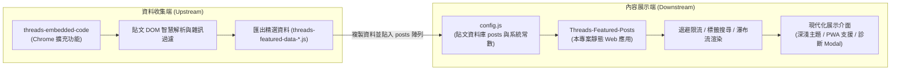
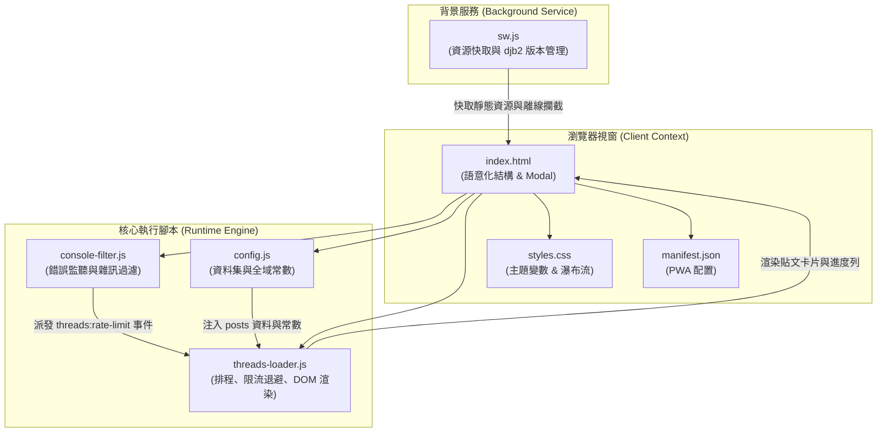
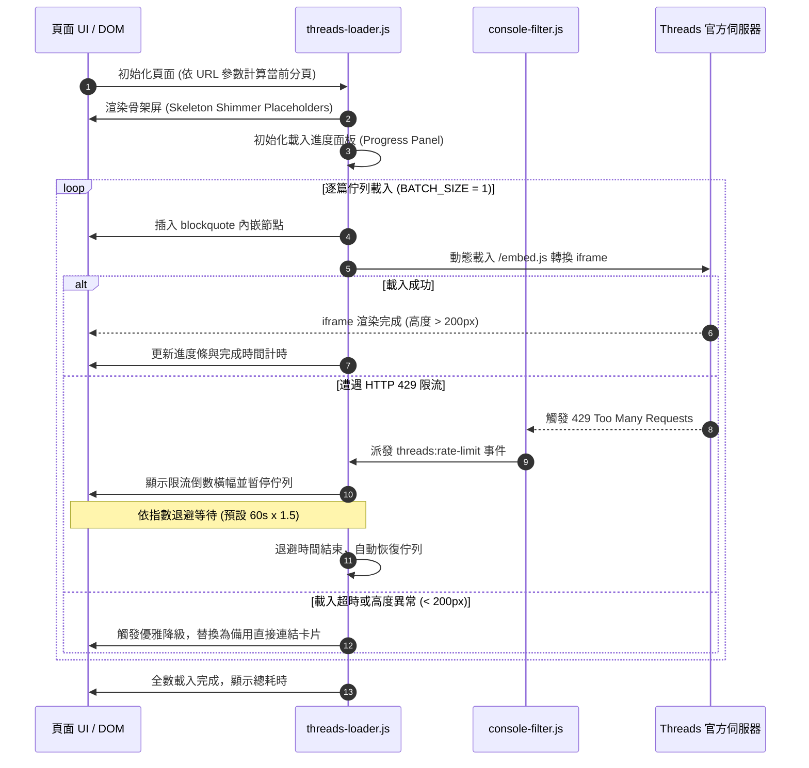

<div align="center">

# Threads 精選貼文展示 (Threads Featured Posts)

**基於純前端技術之精選 Threads 貼文展示、多欄瀑布流排版與智慧限流防護網頁應用**

[](#授權條款)
[](./manifest.json)
[](#技術規格與技術棧)
[](#技術規格與技術棧)
[](https://github.com/Scorpio-meow/threads-embedded-code)

---

[English](./README_EN.md) | 繁體中文

純前端原生架構、零外部框架依賴、開箱即用。  
具備 HTTP 429 速率限制指數退避、Iframe 渲染異常監控與優雅降級、確定性種子隨機排序，  
並結合 Progressive Web App (PWA) 離線快取技術，提供極致流暢的技術貼文瀏覽與檢索體驗。

</div>

---

## 目錄

- [專案簡介與核心價值](#專案簡介與核心價值)
- [生態系與專案關聯](#生態系與專案關聯)
- [快速開始](#快速開始)
  - [前置條件與環境需求](#前置條件與環境需求)
  - [1. 下載專案](#1-下載專案)
  - [2. 配置貼文資料](#2-配置貼文資料)
  - [3. 啟動本機開發伺服器](#3-啟動本機開發伺服器)
- [核心功能特性](#核心功能特性)
  - [1. 智慧搜尋與標籤即時篩選](#1-智慧搜尋與標籤即時篩選)
  - [2. 雙主題系統與 CSS 設計變數](#2-雙主題系統與-css-設計變數)
  - [3. 響應式瀑布流與單欄版面切換](#3-響應式瀑布流與單欄版面切換)
  - [4. 自動限流偵測與指數退避保護](#4-自動限流偵測與指數退避保護)
  - [5. 分塊非阻塞渲染與骨架屏微光動畫](#5-分塊非阻塞渲染與骨架屏微光動畫)
  - [6. 確定性種子隨機排序](#6-確定性種子隨機排序)
  - [7. PWA 支援與 32-bit djb2 內容雜湊快取](#7-pwa-支援與-32-bit-djb2-內容雜湊快取)
  - [8. Iframe 存活監控與優雅降級](#8-iframe-存活監控與優雅降級)
  - [9. 單篇貼文隔離預覽模式](#9-單篇貼文隔離預覽模式)
  - [10. 玻璃擬物載入進度面板](#10-玻璃擬物載入進度面板)
  - [11. 全域 Console 雜訊過濾機制](#11-全域-console-雜訊過濾機制)
  - [12. 常見問題與除錯手風琴對話框](#12-常見問題與除錯手風琴對話框)
- [系統規格與技術棧](#系統規格與技術棧)
- [專案目錄與檔案結構](#專案目錄與檔案結構)
  - [檔案目錄清單](#檔案目錄清單)
  - [模組職責對照表](#模組職責對照表)
- [系統架構與流程圖](#系統架構與流程圖)
  - [系統模組架構圖](#系統模組架構圖)
  - [貼文載入與限流生命週期時序圖](#貼文載入與限流生命週期時序圖)
- [系統配置與資料規範](#系統配置與資料規範)
  - [執行期常數設定表 (RuntimeConfig)](#執行期常數設定表-runtimeconfig)
  - [貼文資料結構 (PostItem)](#貼文資料結構-postitem)
  - [URL 查詢參數規格表 (URLParams)](#url-查詢參數規格表-urlparams)
- [核心演算法與技術實作剖析](#核心演算法與技術實作剖析)
  - [1. 指數退避限流演算法 (Exponential Backoff)](#1-指數退避限流演算法-exponential-backoff)
  - [2. 32-bit djb2 內容雜湊快取比對機制](#2-32-bit-djb2-內容雜湊快取比對機制)
  - [3. 確定性偽隨機洗牌演算法 (Seeded Shuffle)](#3-確定性偽隨機洗牌演算法-seeded-shuffle)
  - [4. Iframe 雙重觀察器與降級替換機制](#4-iframe-雙重觀察器與降級替換機制)
- [常見問題與疑難排解 (FAQ)](#常見問題與疑難排解-faq)
- [開發與部署指南](#開發與部署指南)
  - [本地開發指令](#本地開發指令)
  - [靜態託管部署](#靜態託管部署)
- [版本更新紀錄 (Changelog)](#版本更新紀錄-changelog)
- [AI 友善文件說明 (llm.txt)](#ai-友善文件說明-llmtxt)
- [授權條款與免責聲明](#授權條款與免責聲明)

---

## 專案簡介與核心價值

Threads 平台的官方嵌入卡片具備極高的動態性與社群互動性，但在大量引用展示時，經常面臨跨網域驗證失敗、HTTP 429 速率限制（Too Many Requests）、頁面主線程卡頓與排版崩塌等問題。

本專案「**Threads 精選貼文展示**」是一套針對上述痛點所打造的現代化靜態展示解決方案：

| 核心價值 | 說明 |
| :--- | :--- |
| **高度穩定限流防護** | 全域攔截 429 限流錯誤，以指數退避安全暫停佇列並以倒數計時器自動恢復，徹底解決頁面載入中斷問題。 |
| **優雅降級容錯保證** | 當貼文無法渲染或高度異常（低於 200px）時，自動切換為備用作者卡片與直達按鈕，避免畫面留白破版。 |
| **流暢分塊渲染** | 採用 requestIdleCallback 與 Shimmer 微光骨架屏，貼文依序平滑掛載，大幅優化 INP 與使用者互動體驗。 |
| **極速檢索與篩選** | 支援即時關鍵字模糊搜尋、熱門標籤頻次排序與展開切換，篩選狀態與 URL 參數即時雙向綁定。 |
| **離線快取與 PWA** | 透過 djb2 內容雜湊自動比對版本更新，支援桌面與行動裝置安裝至主畫面以獨立視窗離線運作。 |

---

## 生態系與專案關聯

本專案作為「**內容展示端 (Downstream)**」，與資料收集擴充功能 **[Threads 程式碼儲存器 (threads-embedded-code)](https://github.com/Scorpio-meow/threads-embedded-code)** 緊密協同運作：



1. **資料收集端**：使用 [threads-embedded-code](https://github.com/Scorpio-meow/threads-embedded-code) 在瀏覽 Threads 時一鍵儲存優質內容，點擊「匯出精選資料」產出無 `@` 前綴的結構化配置檔。
2. **內容展示端**：將匯出內容貼入本專案的 [config.js](./config.js) 之中，即可直接上線兼具限流保護、即時檢索與瀑布流美感之精選網站。

---

## 快速開始

### 前置條件與環境需求

- 支援現代標準之瀏覽器（Chrome, Edge, Safari, Firefox, Brave, Arc 等）。
- 靜態檔案伺服器環境（支援 Bun、Node.js、Python 或任何靜態託管平台）。
- 無需編譯建置、無需打包工具、無 npm 執行期相依套件。

### 1. 下載專案

```bash
git clone https://github.com/Scorpio-meow/Threads-Featured-Posts.git
cd Threads-Featured-Posts
```

### 2. 配置貼文資料

開啟 [config.js](./config.js)，將貼文資料填入 `posts` 陣列中：

```javascript
const posts = [
    {
        embedCode: '<blockquote class="text-post-media" data-text-post-permalink="https://www.threads.com/@username/post/xxx">...</blockquote>',
        postLink: 'https://www.threads.com/@username/post/xxx',
        author: 'username',
        content: '貼文純文字內容...',
        tags: ['JavaScript', 'WebDev']
    }
];
```

### 3. 啟動本機開發伺服器

可選擇以下任一種方式啟動本機伺服器以預覽專案：

**方式 A：使用 VS Code / IDE 的「Live Server」擴充功能（最簡便）**
- 安裝「Live Server」擴充功能。
- 在 `index.html` 上按右鍵，選擇「**Open with Live Server**」（預設開啟 `http://127.0.0.1:5500`）。

**方式 B：使用 Bun 啟動（終端機指令推薦）**
```bash
bunx http-server -p 3000
```
啟動後於瀏覽器開啟 `http://localhost:3000` 即可預覽。

**方式 C：使用 Python 啟動（備用方案）**
```bash
python -m http.server 3000
```

---

## 核心功能特性

### 1. 智慧搜尋與標籤即時篩選
- **即時模糊搜尋**：輸入關鍵字即時比對發文者帳號、貼文內文純文字以及所屬 Hashtag。
- **熱門標籤頻次排序**：系統自動統計所有貼文中出現的標籤次數並按降序排列，支援「展開 / 收起」超過預設數量的標籤。
- **雙向 URL 狀態綁定**：搜尋關鍵字 (`?search=`) 與選取標籤 (`?tag=`) 自動寫入網址列，支援直接複製網址分享或加入書籤。

### 2. 雙主題系統與 CSS 設計變數
- **深色 / 淺色主題切換**：頂部提供一鍵主題切換按鈕，使用者偏好自動儲存至 `localStorage`。
- **Threads 原生卡片主題同步**：切換主題時，系統會自動批次更新所有 `blockquote` 節點的 `data-theme` 屬性，確保官方嵌入卡片與網站整體視覺完全一致。
- **全套 CSS Custom Properties**：色彩、字型、圓角、微光動畫等設計 Token 集中於 `styles.css`，易於客製化與擴充。

### 3. 響應式瀑布流與單欄版面切換
- **原生 CSS `columns` 瀑布流**：採用原生 CSS Multi-column 佈局，避免傳統 JS 瀑布流計算重排引起的卡頓，依螢幕解析度自適應切換欄數（大螢幕 3 欄、平板 2 欄、手機 1 欄）。
- **單欄專注清單檢視**：支援在版面控制列一鍵切換為單欄置中清單模式，適合深度閱讀與對照程式碼。

### 4. 自動限流偵測與指數退避保護
- **HTTP 429 智能捕捉**：透過 `console-filter.js` 攔截官方腳本觸發的 429 限流警告，派發全域自訂事件。
- **動態倒數橫幅與暫停**：即時於載入進度面板彈出紅色警示橫幅，動態顯示剩餘退避等待秒數，並自動暫停後續佇列。
- **指數退避演算法**：以基礎 60 秒為起點，每次觸發遞增 1.5 倍（上限 300 秒），倒數完畢自動安全重啟佇列載入。

### 5. 分塊非阻塞渲染與骨架屏微光動畫
- **requestIdleCallback 排程**：在瀏覽器空閒時段進行 DOM 卡片節點掛載，徹底消除大量 DOM 同步操作導致的掉幀與輸入延遲。
- **Shimmer 微光骨架屏**：在官方內嵌資源載入完成前，展示帶有平滑漸變微光動畫的骨架占位圖，確保視覺連貫性。

### 6. 確定性種子隨機排序
- **時間戳記種子隨機化**：點擊「隨機排序」按鈕時產生時間戳記種子並寫入 URL `?random=<seed>`。
- **跨頁與重新整理一致性**：依據該種子計算確定性偽隨機序列，確保使用者在翻頁或重新整理頁面時，文章順序維持完全一致。

### 7. PWA 支援與 32-bit djb2 內容雜湊快取
- **Progressive Web App**：具備完整的 `manifest.json` 與 Service Worker，支援在桌面端 (Chrome/Edge/Safari) 及行動端 (iOS/Android) 安裝為獨立應用。
- **djb2 內容雜湊自動更新**：Service Worker 讀取 6 個核心檔案源碼並計算 32-bit 雜湊值作為快取版號，當檔案有變更時自動淘汰舊快取並重新載入，無快取殘留困擾。

### 8. Iframe 存活監控與優雅降級
- **MutationObserver + ResizeObserver**：雙重監控動態生成的 iframe 節點狀態與高度。
- **自動降級替換**：若 iframe 載入超時（超過 `IFRAME_TIMEOUT`）、遭遇 `X-Frame-Options` 拒絕或高度低於 200px（官方阻擋狀態），系統會自動將其替換為備用卡片，顯示發文作者與「在 Threads 查看此貼文」直達按鈕。

### 9. 單篇貼文隔離預覽模式
- **URL 路由直達**：在網址列帶入 `?post=<URL>` 或 `?post=<Index>`，頁面將自動隱藏搜尋列、標籤列與分頁控制，僅專注呈現該篇貼文。
- **一鍵複製分享**：提供「複製分享連結」按鈕與「返回全部列表」快速導航。

### 10. 玻璃擬物載入進度面板
- **即時指標監控**：即時顯示目前分頁貼文載入進度百分比、當前貼文載入耗時、預計下篇載入時間與預估總剩餘時間。
- **透明毛玻璃設計**：具備現代感十足的 Glassmorphism 視覺風格，不干擾使用者正常閱讀。

### 11. 全域 Console 雜訊過濾機制
- **Console Filter 攔截器**：內建 `console-filter.js`，自動過濾 Threads 官方嵌入腳本產生的跨網域 404 資源警告、favicon 缺失及無關 postMessage 訊息，保持除錯主控台乾淨整潔。

### 12. 常見問題與除錯手風琴對話框
- **頁尾 FAQ Modal**：整合折疊式常見問題診斷說明，包含登入驗證、Do Not Track 設定、速率限制對策等完整指引。
- **一鍵開啟除錯模式**：提供按鈕一鍵為網址追加 `?debug=1`，即時輸出完整除錯日誌。

---

## 系統規格與技術棧

```
+-----------------------------------------------------------------------+
|                             技術架構標準                              |
+-----------------------------------------------------------------------+
|  核心技術    | 原生 HTML5, CSS3 Variables, Vanilla JavaScript (ES6+)   |
|  字體系統    | Google Fonts (Manrope, Noto Sans TC)                   |
|  佈局引擎    | 原生 CSS Columns 瀑布流 + CSS Grid + Flexbox           |
|  離線快取    | Service Worker API (djb2 Content Hash 32-bit 自動比對) |
|  應用交付    | Progressive Web App (Web App Manifest) 支援主畫面安裝  |
|  依賴套件    | 0 External Dependencies (無 npm 執行期依賴、無外部框架)  |
|  託管相容    | 任意靜態 Web 伺服器 (GitHub Pages, Cloudflare, Vercel)  |
+-----------------------------------------------------------------------+
```

---

## 專案目錄與檔案結構

### 檔案目錄清單

```
Threads-Featured-Posts/
├── index.html            # 主頁面語意化 HTML (搜尋列、標籤容器、版面切換、FAQ Modal)
├── config.js             # 貼文資料集 (posts 陣列) 與執行期限流/渲染常數配置
├── threads-loader.js     # 核心調度腳本 (分頁、限流退避、DOM 渲染、標籤統計、進度面板)
├── console-filter.js     # 全域錯誤攔截器 (過濾 404 雜訊、捕捉 429 派發事件)
├── styles.css            # 設計 Token 系統 (CSS 變數、瀑布流、深淺主題、骨架屏、動畫)
├── sw.js                 # PWA Service Worker (djb2 雜湊自動快取失效、離線代理)
├── manifest.json         # PWA 清單設定檔 (名稱、圖示、展示模式、主題色彩)
├── assets/               # 靜態圖示資源目錄 (Favicon, PWA App Icons)
├── llm.txt               # AI 友善架構與 RAG 快速索引規範文件
├── README_EN.md          # 英文說明文件
└── README.md             # 專案中文說明文件 (本檔案)
```

### 模組職責對照表

| 檔案名稱 | 模組層級 | 主要職責與實作內容 |
| :--- | :--- | :--- |
| `index.html` | 視圖結構層 | 宣告現代語意化標籤、搜尋框、主題/版面控制項、分頁按鈕與玻璃擬物彈窗。 |
| `config.js` | 資料與配置層 | 集中存放貼文資料物件陣列與控制限流、延遲、分頁等 11 項關鍵系統參數。 |
| `threads-loader.js` | 核心控制層 | 負責 URL 路由解析、分頁計算、佇列排程、退避計時、DOM 分塊渲染與優雅降級。 |
| `console-filter.js` | 安全攔截層 | 攔截 Console 錯誤，過濾跨網域 404 雜訊，並在遭遇 HTTP 429 時觸發全域事件。 |
| `styles.css` | 視覺樣式層 | 定義 CSS 自訂屬性、深淺主題、瀑布流排版、微光動畫與響應式斷點。 |
| `sw.js` | 背景快取層 | 透過 djb2 內容雜湊比對版本，快取必要靜態資產以支援離線使用與極速載入。 |
| `llm.txt` | 規範說明層 | 提供 AI 代理與 RAG 檢索系統快速索引之結構化摘要說明文件。 |

---

## 系統架構與流程圖

### 系統模組架構圖



### 貼文載入與限流生命週期時序圖



---

## 系統配置與資料規範

### 執行期常數設定表 (RuntimeConfig)

於 [config.js](./config.js) 可自訂下列核心運作常數：

| 配置常數名稱 | 類型 | 預設值 | 說明與安全最佳實踐 |
| :--- | :---: | :---: | :--- |
| `LOAD_DELAY` | number | `4000` | 基礎載入間隔延遲時間 (ms)。建議保持 >= 4000ms 避免觸發風暴。 |
| `BATCH_SIZE` | number | `1` | 單次併發載入 iframe 數量上限。設為 1 可最大程度避免 429 限流。 |
| `EMBED_STAGGER_DELAY` | number | `3600` | 同一批次內相鄰貼文開始載入的間隔時間 (ms)。安全底線為 3600ms。 |
| `IFRAME_TIMEOUT` | number | `3600` | 單個 iframe 載入超時判定門檻 (ms)。超過此時間將執行降級。 |
| `MIN_IFRAME_TIMEOUT` | number | `8000` | 早期 iframe 存在性檢查的安全門檻時間 (ms)。 |
| `RATE_LIMIT_BACKOFF` | number | `60000` | 遭遇 429 速率限制時之基礎退避等待時間 (ms，每次觸發遞增 1.5 倍，上限 300 秒)。 |
| `MAX_DELAY` | number | `60000` | 動態調整延遲時間之最大上限 (ms)。 |
| `MIN_DELAY_BETWEEN_REQUESTS` | number | `3600` | 相鄰請求間最小安全等待間隔 (ms)。 |
| `MAX_VISIBLE_QUEUE` | number | `30` | 記憶體中保留之最大活躍貼文 DOM 節點數量上限。 |
| `PAGE_SIZE_OPTIONS` | number[] | `[1, 3, 5, 10, 25, 50]` | 分頁下拉選單可選之每頁筆數陣列。 |
| `PAGE_SIZE` | number | `10` | 預設每頁顯示之貼文筆數。 |

### 貼文資料結構 (PostItem)

[config.js](./config.js) 中的 `posts` 陣列元素支援標準物件定義：

```typescript
interface PostItem {
  /** 官方 blockquote HTML 內嵌代碼 */
  embedCode: string;

  /** Threads 原始貼文完整 URL */
  postLink: string;

  /** 發文者帳號 (不含 @ 前綴) */
  author: string;

  /** 貼文內文純文字 */
  content: string;

  /** 貼文所屬之 Hashtag 標籤陣列 */
  tags: string[];
}
```

### URL 查詢參數規格表 (URLParams)

系統支援透過 URL 參數控制應用程式狀態，支援書籤收藏與直接分享：

| 參數名稱 | 型別 | 範例 | 說明 |
| :--- | :---: | :--- | :--- |
| `page` | integer | `?page=2` | 指定當前顯示之分頁頁碼 (從 1 起算)。 |
| `page_size` | integer | `?page_size=25` | 指定每頁顯示之貼文數量。 |
| `random` | string | `?random=1717750000000` | 確定性隨機洗牌種子值（時間戳記）。 |
| `search` | string | `?search=前端開發` | 全文檢索關鍵字（模糊比對作者、內文與標籤）。 |
| `tag` | string | `?tag=React` | 精確標籤篩選（不含 `#` 字元）。 |
| `post` | string | `?post=https://www.threads.com/@username/post/xxx` | 單篇貼文預覽模式（可傳入連結或索引值）。 |
| `debug` | string | `?debug=1` | 啟用除錯模式，顯示完整日誌與跨域錯誤。 |

---

## 核心演算法與技術實作剖析

### 1. 指數退避限流演算法 (Exponential Backoff)

當 Meta 伺服器回傳 HTTP 429 狀態碼時，系統會動態計算退避時間並暫停佇列：

```javascript
function handleRateLimitDetected(detail) {
  rateLimitDetected = true;
  var backoffDuration = currentBackoff; // 預設 60000ms
  rateLimitEndTime = Date.now() + backoffDuration;
  
  // 指數遞增下一次的退避時間 (上限 300 秒)
  currentBackoff = Math.min(MAX_BACKOFF_CEILING, currentBackoff * 1.5);
  
  createOrUpdateProgressPanel();
  setTimeout(function() {
    rateLimitDetected = false;
    resumeQueueProcessing();
  }, backoffDuration);
}
```

### 2. 32-bit djb2 內容雜湊快取比對機制

在 `sw.js` 中，透過對核心檔案源碼進行字串雜湊計算，動態決定快取版號：

```javascript
function djb2Hash(str) {
  let hash = 5381;
  for (let i = 0; i < str.length; i++) {
    hash = ((hash << 5) + hash) ^ str.charCodeAt(i);
    hash = hash & hash; // 轉為 32-bit 整數
  }
  return (hash >>> 0).toString(16);
}
```

### 3. 確定性偽隨機洗牌演算法 (Seeded Shuffle)

為確保使用者在隨機排序模式下翻頁或重新整理時文章順序不混亂，系統採用基於種子的線性同餘產生器 (LCG) 實現洗牌：

```javascript
function seededRandom(seed) {
  var x = Math.sin(seed++) * 10000;
  return x - Math.floor(x);
}
function shuffleArrayWithSeed(array, seed) {
  var m = array.length, t, i;
  var currentSeed = parseInt(seed, 10) || 1;
  while (m) {
    i = Math.floor(seededRandom(currentSeed++) * m--);
    t = array[m];
    array[m] = array[i];
    array[i] = t;
  }
  return array;
}
```

### 4. Iframe 雙重觀察器與降級替換機制

為了解決動態載入的 Threads 內嵌 iframe 載入失敗或被 CSP / X-Frame-Options 阻擋問題，採用雙觀察器架構：

1. **MutationObserver** 偵測 iframe 節點建立。
2. **ResizeObserver** 監控高度變化；若高度在逾時後依然小於 200px，立即替換為備用卡片。

---

## 常見問題與疑難排解 (FAQ)

> [!WARNING]
> **問題 1：為什麼部分貼文卡片僅顯示「在 Threads 查看此貼文」按鈕而沒有展開內容？**
> - 這是 Threads 官方內嵌元件的跨網域存取與反爬機制所致。
> - 請確認瀏覽器已登入 [Threads](https://www.threads.com/) 帳號。
> - 請確認瀏覽器未開啟「不要追蹤 (Do Not Track)」設定（該設定會阻擋 Meta 內嵌腳本的第三方 Cookie 驗證）。
> - 確認未被廣告攔截擴充功能（如 uBlock Origin、AdGuard）阻擋 `cdninstagram.com` 或 `threads.com` 資源。

> [!NOTE]
> **問題 2：什麼是「速率限制 (Rate Limit)」？該如何應對？**
> - 當短時間內請求過多 Threads 內嵌卡片時，Meta 伺服器會回傳 HTTP 429 狀態碼。
> - 本專案具備全自動防護機制：系統會立即彈出倒數計時提示列並暫停後續貼文載入，倒數完畢後會以指數退避時間自動恢復載入。
> - 若頻繁遇到限流，建議於 [config.js](./config.js) 中將 `PAGE_SIZE` 調小（如設為 3 或 5），或調大 `LOAD_DELAY` 與 `EMBED_STAGGER_DELAY`。

> [!TIP]
> **問題 3：如何開啟除錯模式？**
> - 在網址列後方加入 `?debug=1` 參數（例如 `http://localhost:3000/?debug=1`）。
> - 即可在瀏覽器開發者工具 (F12) Console 中查看所有被過濾的原始跨域警告與完整排程日誌。

---

## 開發與部署指南

### 本地開發指令

本專案為純前端原生靜態架構，無需編譯打包：

```bash
# 複製專案庫
git clone https://github.com/Scorpio-meow/Threads-Featured-Posts.git
cd Threads-Featured-Posts
```

**伺服器啟動方式：**
1. **VS Code / IDE Live Server**：右鍵點擊 `index.html` 選擇「Open with Live Server」。
2. **Bun 靜態伺服器**：
   ```bash
   bunx http-server -p 3000
   ```
3. **Python 靜態伺服器**：
   ```bash
   python -m http.server 3000
   ```

### 靜態託管部署

由於本專案為純靜態檔案組成，可直接一鍵部署至任何靜態託管平台：

- **GitHub Pages**: 將儲存庫 Settings -> Pages 設定為從 `main` 分支根目錄發布。
- **Cloudflare Pages**: 連結 GitHub 專案庫，Build command 留空，Output directory 設定為 `/`。
- **Vercel / Netlify**: 拖曳資料夾或連結 Git 儲存庫即可自動完成靜態上線。

---

## 版本更新紀錄 (Changelog)

本專案遵循 [Keep a Changelog](https://keepachangelog.com/zh-TW/1.0.0/) 格式規範。

### [Unreleased]

#### 新增
- 實作完整指數退避限流保護 (Exponential Rate-Limiting Backoff)，自動防禦 HTTP 429 限流。
- 新增玻璃擬物 (Glassmorphism) 即時載入進度面板，提供百分比、用時與剩餘時間預估。
- 實作 32-bit djb2 內容雜湊之 Service Worker 自動快取失效機制。
- 新增單篇貼文隔離預覽模式 (`?post=`) 與確定性種子隨機排序 (`?random=`)。
- 實作頁尾常見問題與除錯診斷手風琴 Modal。

#### 改善
- 重構瀑布流版面為原生 CSS `columns` 實現，全面提升滑動效能並消除排版跳動。
- 升級深淺主題色彩系統，支援全域 CSS 自訂屬性動態切換與 blockquote data-theme 屬性聯動。
- 擴充 `console-filter.js` 攔截規則，抑制 404 與 cross-origin postMessage 雜訊。

#### 修正
- 移除手機版貼文嵌入的強制最小高度限制，使行動裝置閱讀體驗更緊湊貼合。
- 修正單篇隔離預覽模式下頁面底部留白異常的問題。

#### 安全性
- 全面修復 CodeQL 靜態分析指出的 DOM XSS 潛在風險，所有動態文字節點與屬性全數改為安全賦值。
- 修復 `threads-loader.js` 中將 DOM 文字重新解析為 HTML 時可能引發的 XSS 漏洞。

---

## AI 友善文件說明 (llms.txt / llm.txt)

本專案已在根目錄提供標準的 **[llms.txt](./llms.txt)** (與相容的 **[llm.txt](./llm.txt)**) 規格文件，專供 AI 代理、LLM 檢索工具與 RAG 索引系統快速讀取與結構化解析：

- 獨立文件路徑：`llms.txt` / `llm.txt`
- 包含內容：專案架構、常數配置 Schema、資料模型介面、5 大核心演算法及運行機制。

---

## 授權條款與免責聲明

### 授權條款

本專案採用 **[MIT 授權條款](https://opensource.org/licenses/MIT)** 開源釋出。您可以自由使用、修改、分發與整合於個人或商業專案中。

### 免責聲明

本應用為第三方獨立開發之開源展示工具，與 Meta 或 Threads 官方無任何關聯、授權或隸屬關係。Threads 原生內嵌內容之智慧財產權歸原發文作者及 Meta 所有。

---

<div align="center">

**Threads 精選貼文展示 (Threads Featured Posts)**  
由 [Scorpio-meow](https://github.com/Scorpio-meow) 開發與維護

</div>