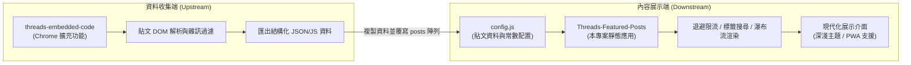
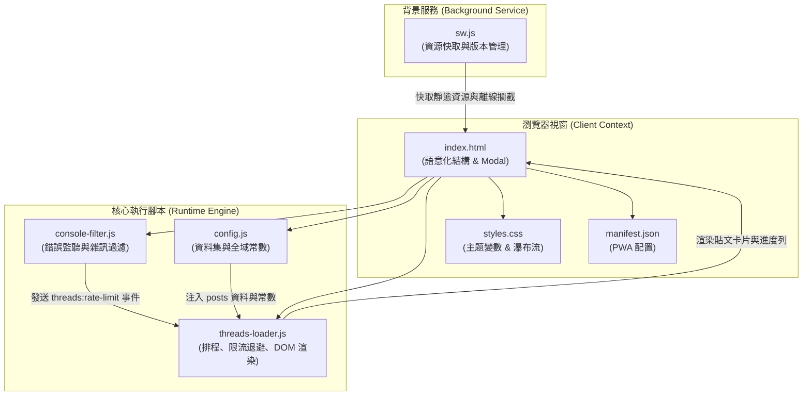
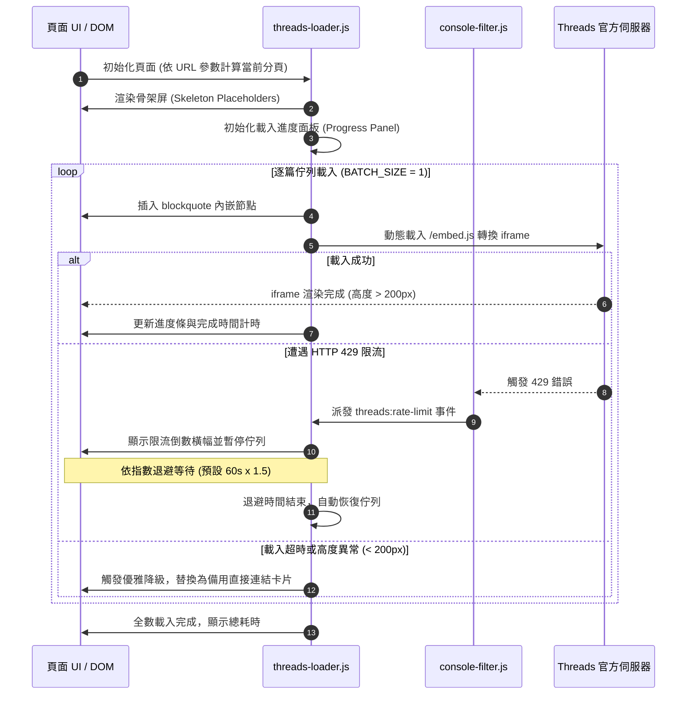

# Threads Featured Posts

[English](./README_EN.md) | 繁體中文

基於純前端技術建置之精緻、響應式且高穩定性 Threads 貼文展示與分頁瀏覽網頁應用。內建速率限制（Rate Limiting）指數退避機制、Iframe 載入錯誤攔截與優雅降級機制、確定性隨機洗牌，並結合漸進式網頁應用（PWA）離線快取，提供流暢的瀏覽、搜尋與展示體驗。

---

## 生態系與專案關聯 (Ecosystem & Integration)

本專案與 [Threads 程式碼儲存器 (threads-embedded-code)](https://github.com/Scorpio-meow/threads-embedded-code) 共同構成完整的 Threads 貼文收藏與展示生態系：



1. **資料收集端**：使用 [threads-embedded-code](https://github.com/Scorpio-meow/threads-embedded-code) 擴充功能於瀏覽 Threads 時一鍵擷取貼文、自動過濾 UI 雜訊並匯出格式化資料。
2. **內容展示端**：本專案讀取 [config.js](./config.js) 資料，進行高穩定性、具備速率退避與搜尋標籤過濾之展示。

---

## 快速開始 (Quick Start)

本專案為純前端靜態專案，無需編譯或安裝複雜依賴，僅需靜態伺服器環境即可運行。

### 1. 下載專案

```bash
git clone https://github.com/Scorpio-meow/Threads-Featured-Posts.git
cd Threads-Featured-Posts
```

### 2. 配置貼文資料

將 Threads Embed Code 放進 [config.js](./config.js) 的 `posts` 陣列中。建議搭配「Threads 程式碼儲存器」瀏覽器擴充功能使用：

1. **安裝擴充功能**：
   ```bash
   git clone https://github.com/Scorpio-meow/threads-embedded-code.git
   ```
   在瀏覽器開啟 `chrome://extensions/`，啟用「開發人員模式」，並點擊「載入未封裝項目」選取擴充功能資料夾。
2. **匯出貼文**：
   於擴充功能管理介面點擊「匯出」，複製結構化陣列資料並覆寫本專案 [config.js](./config.js) 內的 `posts` 變數。

### 3. 啟動本機開發伺服器

建議使用 Bun 快速啟動靜態伺服器預覽專案：

**使用 Bun 啟動（推薦）：**
```bash
bunx http-server -p 3000
```

**使用 Python 啟動（備用）：**
```bash
python -m http.server 3000
```

啟動後前往 `http://localhost:3000` 即可瀏覽。

---

## 核心功能 (Core Features)

- **智慧搜尋與標籤篩選**：支援即時搜尋框，可依作者帳號、貼文內文或 Hashtag 進行模糊匹配。熱門標籤列依出現頻率降序排列，支援展開/收起切換，篩選狀態與 URL 參數即時雙向同步。
- **深淺色主題切換**：提供深色（Dark）與淺色（Light）模式切換，偏好設定自動記錄至 `localStorage`。主題採用完整 CSS 變數系統，切換時自動同步所有 `blockquote` 之 `data-theme` 屬性。
- **彈性版面配置**：支援「瀑布流 (Masonry Grid)」與「單欄列表 (List)」兩種檢視模式。瀑布流採用原生 CSS `columns` 實現，隨螢幕寬度自適應調整欄數。
- **自動限流與指數退避策略**：全域攔截 HTTP 429（Too Many Requests）錯誤與 Threads 官方腳本載入異常。觸發速率限制時自動顯示倒數計時橫幅並暫停佇列載入，透過 1.5 倍指數退避自動恢復。
- **分塊非阻塞渲染**：利用 `requestIdleCallback` 進行 DOM 分塊渲染，在貼文載入前先展示帶有 Shimmer 微光動畫的骨架屏（Skeleton Screen），大幅降低 Interaction to Next Paint (INP) 與頁面卡頓。
- **確定性種子隨機排序**：支援一鍵隨機洗牌，將時間戳記種子寫入 URL `random` 參數，確保跨分頁瀏覽或重新整理時文章順序維持完全一致。
- **PWA 離線快取支援**：內建 Service Worker 與 [manifest.json](./manifest.json)，基於檔案內容 djb2 雜湊自動比對版本更新，支援行動裝置與桌面端安裝至主畫面以獨立視窗離線運作。
- **高強度 Iframe 狀態監控**：使用 `MutationObserver` 與 `ResizeObserver` 監控動態生成的 iframe。當判定高度低於 200px、渲染失敗或載入超時時，自動執行優雅降級，呈現備用卡片與原始貼文直達連結。
- **單篇貼文隔離預覽模式**：支援透過 URL 參數 `post` 指定貼文連結或索引直接進入單篇預覽模式，自動隱藏全域搜尋、標籤列與分頁控制器，並提供一鍵分享複製 URL。
- **嵌入載入進度面板**：玻璃擬物風格的即時載入進度面板，即時呈現載入百分比、當前貼文用時、預估下一篇載入時間與總剩餘時間。
- **Console 雜訊過濾**：內建 [console-filter.js](./console-filter.js) 攔截器，自動遮蔽跨網域 404 資源警告、favicon 缺失警告與無關 postMessage 訊息，保持開發者工具控制台整潔。
- **常見問題與除錯模組**：頁尾整合玻璃擬物 FAQ 手風琴對話框，支援一鍵啟用 `?debug=1` 偵錯模式以輸出完整日誌。

---

## 系統配置與資料規範 (Configuration & Data Formats)

### 系統運作參數設定 (Configuration Settings)

於 [config.js](./config.js) 可調整以下常數設定：

| 配置項 | 類型 | 預設值 | 說明 |
| :--- | :---: | :---: | :--- |
| `LOAD_DELAY` | number | `4000` | 基礎載入間隔延遲時間 (ms，安全底線為 4000ms) |
| `BATCH_SIZE` | number | `1` | 單次併發載入 iframe 數量上限 (設為 1 可最大程度避免 429 限流) |
| `EMBED_STAGGER_DELAY` | number | `3600` | 同一批次內相鄰貼文開始載入的間隔時間 (ms，安全底線為 3600ms) |
| `IFRAME_TIMEOUT` | number | `3600` | 單個 iframe 載入超時判定門檻 (ms) |
| `MIN_IFRAME_TIMEOUT` | number | `8000` | 早期 iframe 存在性檢查的安全門檻時間 (ms) |
| `RATE_LIMIT_BACKOFF` | number | `60000` | 遭遇 429 速率限制時之基礎退避等待時間 (ms，每次觸發遞增 1.5 倍，上限 300 秒) |
| `MAX_DELAY` | number | `60000` | 動態調整延遲時間之最大上限 (ms) |
| `MIN_DELAY_BETWEEN_REQUESTS` | number | `3600` | 相鄰請求間最小安全等待間隔 (ms) |
| `MAX_VISIBLE_QUEUE` | number | `30` | 記憶體中保留之最大活躍貼文節點數量上限 |
| `PAGE_SIZE_OPTIONS` | number[] | `[1, 3, 5, 10, 25, 50]` | 分頁下拉選單可選之每頁筆數陣列 |
| `PAGE_SIZE` | number | `10` | 預設每頁顯示之貼文筆數 |

### 貼文資料格式 (Data Formats)

[config.js](./config.js) 中的 `posts` 陣列支援以下結構：

#### 結構化物件格式（推薦）

```javascript
const posts = [
    {
        embedCode: '<blockquote class="text-post-media" data-text-post-permalink="https://www.threads.com/@username/post/xxx">...</blockquote>',
        postLink: 'https://www.threads.com/@username/post/xxx',
        author: 'username',
        content: '貼文純文字內容...',
        tags: ['標籤一', '標籤二']
    }
];
```

#### 純 HTML 字串格式（相容舊版）

```javascript
const posts = [
    '<blockquote class="text-post-media" data-text-post-permalink="https://www.threads.com/@username/post/xxx">...</blockquote>'
];
```

### TypeScript 型別定義

```typescript
interface PostItem {
    embedCode: string;   // 官方 blockquote HTML 內嵌代碼
    postLink: string;    // Threads 原始貼文完整 URL
    author: string;      // 發文者帳號（不含 @）
    content: string;     // 貼文內文純文字
    tags: string[];      // 貼文所屬之 Hashtag 標籤陣列
}
```

### URL 查詢參數說明 (URL Query Parameters)

系統支援透過 URL 參數控制應用程式狀態，支援書籤收藏與直接分享：

| 參數名稱 | 型別 | 範例 | 說明 |
| :--- | :---: | :--- | :--- |
| `page` | integer | `?page=2` | 指定當前顯示之分頁頁碼 |
| `page_size` | integer | `?page_size=25` | 指定每頁顯示之貼文數量 |
| `random` | string | `?random=1717750000000` | 確定性隨機洗牌種子值（時間戳記） |
| `search` | string | `?search=前端開發` | 全文檢索關鍵字（匹配作者、內文與標籤） |
| `tag` | string | `?tag=React` | 精確標籤篩選（不含 `#` 字元） |
| `post` | string | `?post=https://www.threads.com/@username/post/xxx` | 單篇貼文預覽模式（可傳入連結或索引值） |
| `debug` | string | `?debug=1` | 啟用除錯模式，顯示完整日誌與跨域錯誤 |

---

## 系統架構與技術細節 (Architecture & Technical Details)

### 技術棧 (Tech Stack)

| 分類 | 技術名稱 | 說明 |
| :--- | :--- | :--- |
| **前端架構** | 原生 HTML5 / CSS3 / Vanilla JavaScript | 零第三方重型框架，極速載入 |
| **字體系統** | Google Fonts (Manrope, Noto Sans TC) | 兼具現代幾何美感與繁體中文閱讀體驗 |
| **樣式系統** | 原生 CSS 變數 / 玻璃擬物 (Glassmorphism) / CSS `columns` 瀑布流 | 支援流暢深淺主題切換與響應式排版 |
| **離線快取** | Service Worker API / Cache Storage API | 基於 djb2 雜湊比對之全自動版本更新快取 |
| **應用安裝** | Web App Manifest (PWA) | 支援 Android、iOS、macOS 與 Windows 獨立應用安裝 |
| **部署相容** | 靜態 Web 伺服器 | 支援 GitHub Pages、Cloudflare Pages、Vercel、Netlify 等 |

### 模組架構與相依關係



### 貼文載入與限流生命週期



---

## 常見問題與除錯 (FAQ & Troubleshooting)

### Q1: 為什麼部分貼文卡片僅顯示「在 Threads 查看此貼文」按鈕而沒有展開內容？
這是 Threads 官方內嵌元件的跨網域存取與反爬機制所致。要正常渲染官方嵌入卡片，請確認：
1. 瀏覽器已登入 [Threads](https://www.threads.com/) 帳號。
2. 瀏覽器未開啟「不要追蹤 (Do Not Track)」設定（該設定會阻擋 Meta 內嵌腳本的第三方 Cookie 驗證）。
3. 未被廣告攔截擴充功能（如 uBlock Origin、AdGuard）阻擋 `cdninstagram.com` 或 `threads.com` 資源。

### Q2: 什麼是「速率限制 (Rate Limit)」？該如何應對？
當短時間內請求過多 Threads 內嵌卡片時，Meta 伺服器會回傳 HTTP 429 狀態碼。本專案具備全自動防護機制：
- 系統會立即彈出倒數計時提示列並暫停後續貼文載入。
- 倒數完畢後會以指數退避時間自動恢復載入。
- 若頻繁遇到限流，建議於 [config.js](./config.js) 中將 `PAGE_SIZE` 調小（如設為 3 或 5），或調大 `LOAD_DELAY` 與 `EMBED_STAGGER_DELAY`。

### Q3: 如何開啟除錯模式？
在網址列後方加入 `?debug=1` 參數（例如 `http://localhost:3000/?debug=1`），即可在瀏覽器開發者工具 (F12) Console 中查看所有被過濾的原始跨域警告與完整排程日誌。

---

## 授權條款 (License)

本專案採用 [MIT License](./LICENSE) 授權釋出。