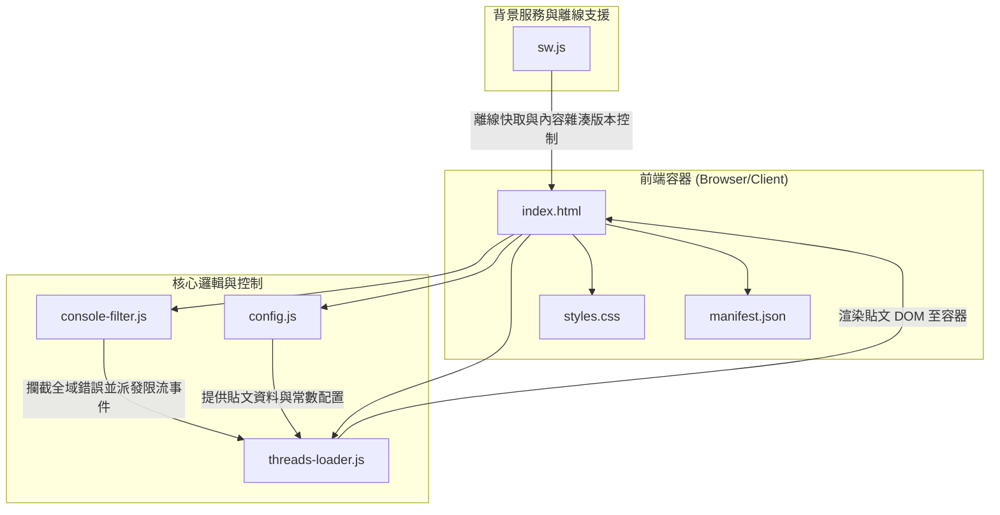
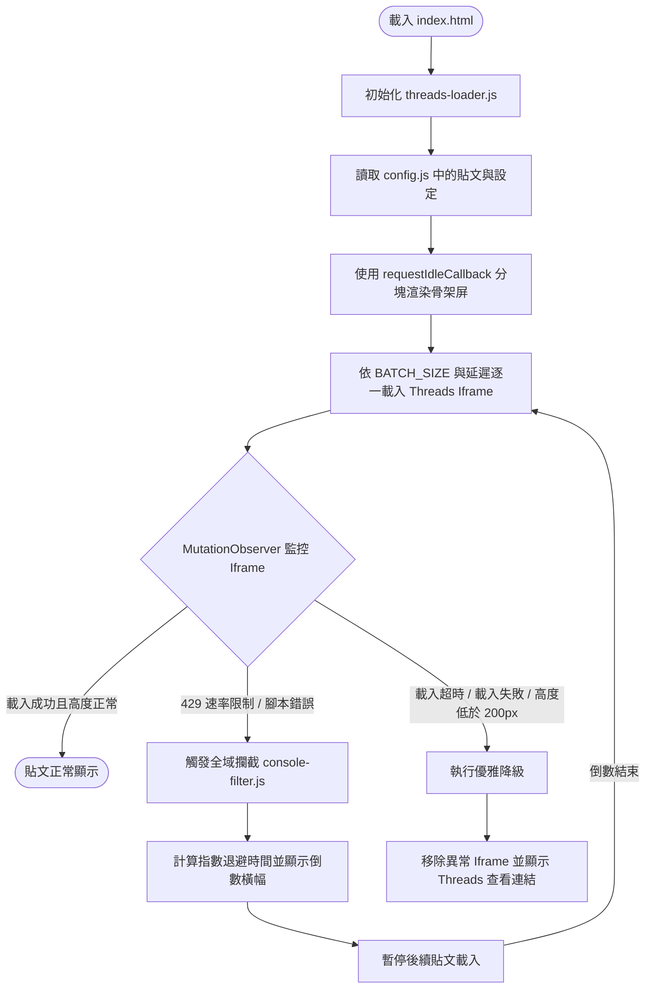

# Threads Featured Posts

[English](./README_EN.md) | 繁體中文

這是一個基於純前端技術建置的精緻、響應式且高穩定性的網頁應用程式，專門用於展示與分頁瀏覽 Threads 貼文。專案內建強大的速率限制（Rate Limiting）退避機制、Iframe 載入錯誤攔截與優雅降級機制，並結合漸進式網頁應用（PWA）離線快取，提供無縫且流暢的使用者體驗。

---

## 快速開始 (Quick Start)

本專案為純前端靜態專案，無需編譯或安裝複雜依賴，僅需純前端環境即可運行。

### 1. 下載專案

```bash
git clone https://github.com/Scorpio-meow/Threads-Featured-Posts.git
cd Threads-Featured-Posts
```

### 2. 配置貼文資料

您可以手動將從 Threads 官方取得的 Embed Code 放進 [config.js](./config.js) 的 `posts` 陣列中，但為求效率，建議搭配「Threads 程式碼儲存器」瀏覽器擴充功能使用：

1. **安裝 Threads 程式碼儲存器**：
   這是一個專屬的瀏覽器擴充功能，能幫您在瀏覽 Threads 時一鍵捕捉並管理貼文。
   ```bash
   git clone https://github.com/Scorpio-meow/threads-embedded-code.git
   ```
   - 進入瀏覽器的擴充功能管理頁（例如 `chrome://extensions/`），開啟「開發人員模式」。
   - 點擊「載入未封裝項目（Load unpacked）」，選取下載的 `threads-embedded-code` 資料夾。

2. **匯出貼文並覆寫設定檔**：
   使用該擴充功能捕捉貼文後，於管理介面點擊「匯出」，複製取得的 HTML 結構化陣列資料，並直接覆寫本專案 [config.js](./config.js) 內的 `posts` 變數。

### 3. 啟動本機開發伺服器

推薦使用 Bun 快速啟動靜態伺服器來預覽專案：

**使用 Bun 啟動（推薦）：**
```bash
bunx http-server -p 3000
```

**使用 Python 啟動（備用）：**
```bash
python -m http.server 3000
```

啟動後，開啟瀏覽器前往 `http://localhost:3000` 即可瀏覽。

---

## 核心功能 (Features)

- **搜尋與標籤篩選**：提供即時搜尋輸入框搭配搜尋按鈕，可依作者帳號、貼文內文或 Hashtag 進行模糊比對。頁面頂部設有熱門標籤篩選列，依標籤頻率降序排列，預設僅顯示前 10 個最熱門標籤。折疊式設計支援「更多/收起」切換，且所有篩選狀態與 URL 參數即時同步，方便複製分享。
- **手動與系統主題切換**：控制列提供主題切換按鈕，可於深色與淺色模式之間手動切換。偏好記錄至 `localStorage`。深色與淺色主題各自擁有完整的 CSS 變數設計系統，並會在嵌入貼文的 `blockquote` 上動態設定 `data-theme` 屬性以同步 Threads 官方嵌入樣式。
- **版面配置切換**：提供「瀑布流 (Masonry Grid)」與「單欄列表 (List)」兩種版面供自由切換。瀑布流模式使用 CSS `columns` 實現，在寬螢幕下以多欄瀑布流排列，窄螢幕自動降為單欄。偏好以 `localStorage` 持久化儲存。
- **自動限流與指數退避策略**：全域攔截 HTTP 429 錯誤與 Threads 腳本錯誤，若觸發速率限制會自動呈現倒數計時橫幅，暫停載入後續貼文，並透過動態計算的回避時間（Backoff）自動恢復，避免前端請求爆量。支援讀取伺服器回應的 `Retry-After` 標頭以精確退避。
- **效能優化與分塊渲染**：利用 `requestIdleCallback` 以分塊方式渲染 DOM。先展示骨架屏（Skeleton Screen）搭配 shimmer 動畫佔位，避免阻塞瀏覽器主執行緒。若偵測到單次 DOM操作耗時超過 16 毫秒，自動將後續分塊大小按比例縮減，確保交互回應速度（INP）。
- **確定性隨機洗牌**：支援一鍵切換隨機與預設排序。隨機排序模式下，提供「重新洗牌」按鈕以產生新種子重新整理排序，並使用基於 URL 參數的隨機排序種子（Seed）以確保分頁時的文章順序一致。
- **PWA 離線支援**：支援離線存取功能，利用 Service Worker 快取核心資源。提供完整的 [manifest.json](./manifest.json) 設定檔，支援在行動裝置與桌面端進行應用程式安裝與獨立視窗運行。動態快取版本雜湊機制，核心檔案任一變更即自動觸發快取更新。
- **高強度 Iframe 監控**：使用 `MutationObserver` 監控動態生成的 iframe。能自動捕捉錯誤頁面、高度低於安全門檻 (200px) 的異常 iframe。並以 `ResizeObserver` 監測 iframe 實際高度，若判定載入失敗或超時，則執行優雅降級，顯示「在 Threads 查看此貼文」之備用連結。
- **單篇預覽模式**：支援透過 URL 參數 `post` 指定單篇貼文連結或索引，進入單篇預覽模式，此時自動隱藏控制列、標籤篩選列與分頁元件。每張貼文卡片提供分享複製預覽 URL 按鈕。
- **貼文嵌入載入進度面板**：展示精緻的玻璃擬物載入進度面板，包含載入百分比與動態進度條。即時預估並倒數下一篇貼文開始載入時間、當前貼文載入用時、預計全部載入時間與全部載入完成用時。
- **自動過濾 Console 雜訊**：內建 [console-filter.js](./console-filter.js) 攔截器，自動遮蔽 Threads 官方嵌入腳本產生的 `postMessage`、跨網域 404 資源警告與 `favicon.ico` 缺失錯誤，將特定錯誤轉換為自訂事件派發給核心邏輯處理。
- **常見問題與除錯模組**：頁尾整合「常見問題與除錯」按鈕，點擊後以玻璃擬物化的手風琴式對話框展示。對話框內附有偵錯模式按鈕，可一鍵切換網址的 `?debug=1` 參數並重新整理。

---

## 配置與資料格式 (Configuration & Data Formats)

### 系統配置設定 (Configuration Settings)

於 [config.js](./config.js) 檔案頂部可以調整以下常數以優化應用程式行為：

| 配置項 | 說明 | 預設值 |
| :--- | :--- | :---: |
| `LOAD_DELAY` | 指數退避機制解除後，或遭遇限流時的基礎加載等待時間（毫秒。**底層安全限制最低值為 4000 毫秒**） | `4000` |
| `BATCH_SIZE` | 小批次併發載入上限（**底層安全限制最高值為 1**，以符合官方 API 頻率限制） | `1` |
| `EMBED_STAGGER_DELAY` | 同一併發批次內，相鄰兩篇貼文開始載入的時間錯開間隔（毫秒。**底層安全限制最低值為 3600 毫秒**） | `3600` |
| `IFRAME_TIMEOUT` | 單個 iframe 載入的超時等待時間（毫秒） | `3600` |
| `MIN_IFRAME_TIMEOUT` | 開始進行早期 iframe 存在性檢查的最小等待時間門檻（毫秒） | `8000` |
| `RATE_LIMIT_BACKOFF` | 遭遇限流 (429) 時的基礎退避時間（毫秒，後續重試將以此基礎進行 1.5 倍指數遞增，上限 300 秒） | `60000` |
| `MAX_DELAY` | 動態延遲時間的上限（毫秒） | `60000` |
| `MIN_DELAY_BETWEEN_REQUESTS` | 相鄰兩次嵌入請求之間的最小安全等待間隔（毫秒） | `3600` |
| `MAX_VISIBLE_QUEUE` | 限制瀏覽器中同時載入/渲染的貼文卡片最大佇列數量，防止記憶體洩漏與效能下降 | `30` |
| `PAGE_SIZE_OPTIONS` | 分頁大小控制列提供的每頁顯示筆數選項陣列 | `[1, 3, 5, 10, 25, 50]` |
| `PAGE_SIZE` | 預設的每頁顯示貼文筆數（需存在於 `PAGE_SIZE_OPTIONS` 中） | `10` |

### 貼文資料格式 (Data Formats)

[config.js](./config.js) 中的 `posts` 陣列支援兩種格式：

#### 格式一：純 HTML 字串

```javascript
const posts = [
    '<blockquote class="text-post-media" data-text-post-permalink="https://...">...</blockquote>',
    // ...
];
```

> [!WARNING]
> 系統會自動解析 DOM 擷取作者、內文與標籤，但可能因 HTML 結構差異而不完整，搜尋與標籤匹配效能較低。

#### 格式二：結構化物件（推薦）

```javascript
const posts = [
    {
        embedCode: '<blockquote class="text-post-media" ...>...</blockquote>',
        postLink: 'https://www.threads.net/@username/post/xxx',
        author: 'username',
        content: '貼文內文...',
        tags: ['標籤一', '標籤二']
    },
    // ...
];
```

> [!NOTE]
> 明確宣告各欄位可獲得最佳的搜尋與標籤匹配效能。此格式由「Threads 程式碼儲存器」擴充功能自動匯出。

### URL 查詢參數說明 (URL Query Parameters)

本應用程式支援完整的 URL 狀態同步，可透過以下參數直接存取特定的頁面狀態：

| 參數 | 說明 | 範例 |
| :--- | :--- | :--- |
| `page` | 目標顯示的頁碼。 | `?page=2` |
| `page_size` | 每頁顯示的貼文筆數，必須符合 [config.js](./config.js) 中的 `PAGE_SIZE_OPTIONS` 選項。 | `?page_size=25` |
| `random` | 隨機排序的種子值（隨機時間戳記），帶有此參數時即啟用確定性隨機洗牌。 | `?random=1717750000000` |
| `search` | 搜尋關鍵字，支援對作者帳號、貼文內文與標籤進行模糊匹配。 | `?search=技術` |
| `tag` | 精確標籤篩選，僅顯示包含該標籤的貼文（不包含字元 `#`）。 | `?tag=程式` |
| `post` | 單篇預覽模式。值可為目標貼文的原始連結 (`postLink`)，或其在 `activePosts` 中的全域索引。在此模式下只會載入並渲染該單篇貼文，並隱藏控制列、標籤與分頁。 | `?post=https://www.threads.net/@username/post/xxx` |
| `debug` | 設定為 `1` 時會停用 [console-filter.js](./console-filter.js)，完整輸出所有日誌與跨域錯誤。 | `?debug=1` |

---

## 系統架構與技術細節 (Architecture & Technical Details)

### 技術棧 (Tech Stack)

| 分類 | 技術描述 |
| :--- | :--- |
| **前端核心** | 純 HTML5, CSS3, Vanilla JavaScript（ES5/ES6 相容） |
| **框架依賴** | 零外部框架依賴（Zero dependencies） |
| **字體系統** | Manrope 與 Noto Sans TC（Google Fonts，含 preconnect 最佳化） |
| **樣式系統** | 現代原生 CSS（CSS 變數設計系統、玻璃擬物效果、Shimmer 載入動畫、CSS Grid/Flexbox 混合佈局、CSS `columns` 瀑布流、`@supports` 漸進增強、`prefers-reduced-motion` 無障礙適配） |
| **離線技術** | Service Worker API（Cache Storage）、Web App Manifest |
| **部署環境** | 支援 any 靜態網頁伺服器（如 GitHub Pages, Vercel, Netlify） |

### 檔案與組件關係圖



### 系統執行流程圖



### 目錄結構說明

- [assets/icons/](./assets/icons/) : 圖示資源目錄。
  - [apple-touch-icon.png](./assets/icons/apple-touch-icon.png) : Apple 裝置觸控圖示 (180x180)。
  - [favicon.ico](./assets/icons/favicon.ico) : 傳統瀏覽器 Favicon。
  - [favicon-192x192.png](./assets/icons/favicon-192x192.png) : PWA 標準圖示 (192x192, any + maskable)。
  - [favicon-512x512.png](./assets/icons/favicon-512x512.png) : PWA 大尺寸圖示 (512x512, any + maskable)。
- [config.js](./config.js) : 設定檔（貼文資料 posts 陣列、分頁常數、速率限制延遲設定）。
- [console-filter.js](./console-filter.js) : Console 雜訊過濾器（最先載入以攔截全域錯誤與自訂事件派發）。
- [index.html](./index.html) : 網頁主架構與 DOM 容器（含 SEO meta、PWA manifest、Google Fonts preconnect）。
- [manifest.json](./manifest.json) : PWA 應用程式設定檔（安裝名稱、顏色、圖示與啟動 URL）。
- [styles.css](./styles.css) : UI 樣式表（CSS 變數設計系統、深/淺色主題、玻璃擬物、瀑布流、動畫、響應式斷點）。
- [sw.js](./sw.js) : Service Worker 腳本（內容雜湊快取版本控制、Network-First 策略、離線降級）。
- [threads-loader.js](./threads-loader.js) : 核心業務邏輯（分頁、搜尋、標籤篩選、限流退避、Iframe 監控、分塊渲染、主題/版面切換、永久連結、單篇預覽）。

### 關鍵技術實現細節

#### 1. 速率限制（Rate Limiting）與指數退避機制
Threads 官方嵌入腳本在短時間內處理大量貼文請求時，會對用戶端 IP 實行速率限制（拋出 HTTP 429 Too Many Requests 錯誤）。本專案透過以下設計解決此問題：
- **小批次併發限制與底層安全限制**：在載入貼文時，系統不會一次性載入整頁。雖然可在 [config.js](./config.js) 中自訂 `BATCH_SIZE` 與 `EMBED_STAGGER_DELAY`，但為了嚴格遵循 Threads 官方 oEmbed 每小時上限 1000 次請求的限制（平均每 3.6 秒一次），底層 `threads-loader.js` 已自動實施了安全校正：將 `BATCH_SIZE` 強制上限限制為 `1`（單筆依序載入），`EMBED_STAGGER_DELAY` 強制限制為至少 `3600` 毫秒（3.6 秒），且基礎載入延遲 `LOAD_DELAY` 強制限制為至少 `4000` 毫秒（4 秒），最小安全等待間隔 `MIN_DELAY_BETWEEN_REQUESTS` 強制限制為至少 `3600` 毫秒。每次載入皆會加入隨機抖動（Jitter）避免請求同步化。
- **全域攔截**：在 [threads-loader.js](./threads-loader.js) 中複寫了 `window.fetch` 以及 `XMLHttpRequest.prototype.send`，並透過監聽 `window.onerror` 以及 `window.onunhandledrejection`，捕捉 any 含有 `429`、`rate limit` 或 `Too Many Requests` 字樣的錯誤。同時監聽 [console-filter.js](./console-filter.js) 派發的自訂事件 `threads:rate-limit`。
- **Retry-After 標頭解析**：當攔截到 HTTP 429 回應時，系統會嘗試讀取 `Retry-After` 標頭值，以伺服器建議的等待時間作為退避參考。
- **指數退避 (Exponential Backoff)**：當偵測到速率限制時，系統會立即暫停後續貼文的載入，並清除當前正在載入中的 iframe；依據連續錯誤次數計算退避等待時間：`Math.min(RATE_LIMIT_BACKOFF * Math.pow(1.5, 錯誤次數 - 1), 300000 毫秒)`；在 `#posts-container` 頂部插入一個倒數計時橫幅，動態顯示距離恢復載入的剩餘秒數；倒數計時結束後，自動重設為安全加載狀態並調低延遲，恢復貼文載入流程。
- **錯誤次數自動衰減**：每次 fetch 成功回應時，連續錯誤計數會逐步遞減，使系統自然回復正常延遲水準。

#### 2. MutationObserver Iframe 異常檢測與優雅降級
由於 Threads 貼文可能因作者隱私設定變更或跨網域安全性政策（`X-Frame-Options: deny`）導致 iframe 無法正確顯示，專案實作了防呆機制：
- **DOM 變更監控**：利用 `MutationObserver` 監聽貼文容器內部節點。當偵測到 `embed.js` 動態生成 iframe 並將其插入 DOM 或取代 blockquote 時，立即綁定該 iframe 的 `load` 與 `error` 事件。
- **異常狀態判定**：
  - 當 iframe `load` 事件觸發後，若其 `src` 包含 `chrome-error:` 或 `chromewebdata` 網址，判定載入失敗。
  - 當 iframe 指向已知的 Facebook 錯誤網域（`facebook.com`、`fb.com`、`static.xx.fbcdn.net` 等），判定載入失敗。
  - 當 iframe 完成渲染後，利用 `ResizeObserver`（不支援時降級為定時輪詢）監測其高度。若高度低於 `SUCCESS_HEIGHT_THRESHOLD`（200px），判定載入失敗。
  - 當 iframe 在 `IFRAME_TIMEOUT`（預設 3600 毫秒）內未能達到成功高度，判定為超時失敗。
  - 當 `threads:xframe-block` 自訂事件觸發時，從錯誤訊息中提取被阻擋的 URL，精確定位對應 iframe 並標記失敗。
- **早期超時檢查**：在 `MIN_IFRAME_TIMEOUT`（預設 8000 毫秒）時進行早期檢查，若此時仍未偵測到 iframe 元素，記錄警告以輔助除錯。
- **優雅降級**：一旦判定失敗，系統會立即移除異常 iframe（高度低於 50px 者），將對應的 blockquote 標記為 `dataset.embedFailed`，並在卡片底部動態渲染「在 Threads 查看此貼文」文字連結。

#### 3. requestIdleCallback 高效分塊渲染
為避免一次向 DOM 插入過多貼文結構而阻礙瀏覽器的渲染主執行緒，專案採用了時間分片渲染技術：
- **分塊渲染**：核心函數 `appendPostsInChunks` 接收當前頁面的貼文資料，並以 `CHUNK_APPEND_SIZE`（預設 20）筆為一組進行分塊。
- **空閒排程**：利用 `window.requestIdleCallback`（不支援的瀏覽器將自動降級使用 `requestAnimationFrame` 或 `setTimeout(fn, 16)`）在瀏覽器每幀的空閒時間內向 DOM 推入貼文 HTML，並先展示骨架屏。
- **時間剩餘檢查**：在 `requestIdleCallback` 回呼中主動檢查 `deadline.timeRemaining()`，若剩餘時間不足 8 毫秒則中斷當次批次，等待下一幀再繼續。
- **動態縮小分塊**：在分塊渲染過程中，如果使用 `performance.now()` 偵測到單次 DOM 操作耗時超過 16 毫秒，系統會自動將後續的分塊大小按比例縮減至 75%（最低 5 筆），確保頁面的交互回應速度（INP）與滑動順暢度。
- **DocumentFragment 批次插入**：使用 `document.createDocumentFragment()` 組裝批次 DOM 節點，減少直接操作 DOM 樹的次數。

#### 4. 隨機排序與種子洗牌演算法 (Seeded Shuffle)
當使用者在啟用隨機排序的情況下切換分頁時，若每次隨機結果不同，會導致使用者在不同分頁看到重複的貼文。為了解決此問題，專案引入了確定性隨機洗牌演算法：
- **隨機種子**：在隨機排序模式下，URL 參數會包含一個 `random=種子值`（通常為啟用隨機時的時間戳記）。
- **確定性洗牌**：透過 `shuffleWithSeed` 函式，利用線性同餘產生器（Linear Congruential Generator, LCG）的遞迴公式 `(seed * 9301 + 49297) % 233280` 作為虛擬隨機數來源。在相同的種子值下，無論重新整理頁面或切換至任何分頁，洗牌後的陣列順序均完全一致，保證分頁瀏覽邏輯的正確性。
- **Fisher-Yates 洗牌**：結合 Fisher-Yates 演算法，從陣列末端向前逐一交換，確保每個元素被放置到每個位置的機率相等。

#### 5. PWA 與 Service Worker 快取機制
專案具備完整的漸進式網頁應用程式（PWA）特性，支援離線快取與本地快取更新比對：
- **動態快取版本雜湊**：在 [sw.js](./sw.js) 安裝階段，會透過 `getVersionHash` 函式對 6 個核心檔案（[config.js](./config.js), [threads-loader.js](./threads-loader.js), [console-filter.js](./console-filter.js), [styles.css](./styles.css), [index.html](./index.html), [manifest.json](./manifest.json)）發送 `fetch` 請求（帶 `cache: 'no-store'`），將其文字內容合併後通過 `djb2Hash` 雜湊演算法計算出一個唯一的 16 進位內容特徵值。搭配全域結構版本號（`SW_SCHEMA_VERSION`，目前為 `'3'`）組合成快取名稱 `threads-featured-posts-v3-{hash}`。這代表開發者只要修改 any 一個核心檔案，快取雜湊就會自動改變，觸發 Service Worker 的啟用階段以清理舊版本的快取快照。
- **快取名稱持久化**：使用獨立的 `threads-featured-posts-meta` 快取儲存當前活躍的快取區域名稱。此機制確保了快取寫入與讀取時的命名一致性，並在更新快取時避免資源讀取衝突。
- **Network-First 快取原則**：對 HTML（`accept: text/html`）、CSS 與 JS 等核心檔案採用 Network-First 策略，優先獲取最新網路資源，若離線或網路連線失敗，則自動讀取快取中的備用檔案。HTML 請求失敗時額外提供 `index.html` 作為 SPA 降級。
- **Cache-First 靜態資源**：對圖示等非核心靜態資源採用 Cache-First 策略，優先讀取快取以加速頁面載入。
- **快取清理**：在 `activate` 階段，Service Worker 會自動檢查並清理所有非當前活躍快照版本且非 meta 快取的舊快取檔案。
- **跨域請求處理**：對非同源的請求（如 Google Fonts CDN、Threads embed.js），採用 Network-Only 策略並在失敗時嘗試快取回退。

#### 6. Console 雜訊過濾器 (console-filter.js)
Threads 官方嵌入檔案 `embed.js` 在執行期間會拋出大量關於跨網域 `postMessage` 的安全警告以及 CDN 資源載入警告。
- **靜音機制**：在 [index.html](./index.html) 的 `<head>` 區段第一順位載入 [console-filter.js](./console-filter.js)。透過複寫 `window.console.error` 與 `window.console.warn`，使用正規表達式篩選出無關的安全警告或跨網域警告並將其過濾。
- **自訂事件轉換**：
  - 若攔截到的錯誤/警告訊息中包含 `429`、`rate limit` 或 `Too Many Requests`，過濾器會主動向全域派發自訂事件 `threads:rate-limit`，交由核心邏輯進行退避處理。
  - 若攔截到 `Refused to display ... in a frame because it set 'X-Frame-Options' to 'deny'` 訊息，派發 `threads:xframe-block` 事件，交由核心邏輯精確定位失敗的 iframe 並執行降級。
- **除錯模式**：若 URL 查詢參數包含 `debug=1`，則過濾器會暫停運作，完整顯示所有 Console 的原始警告與日誌。

#### 7. 分頁與狀態同步
- **智慧省略頁碼**：當總頁數超過 9 頁時，分頁導航會自動使用省略號（`...`）縮略中間頁碼，僅顯示首頁、末頁與當前頁碼周圍各 2 頁。
- **雙分頁導航**：頁面頂部與底部各提供一組完整的分頁導航，使用者無需滾動至頁面頂部即可切換頁面。
- **每頁筆數控制**：提供下拉選單切換每頁顯示筆數（預設選項為 1, 3, 5, 10, 25, 50），切換時自動重設至第一頁。
- **狀態同步與監聽**：支援瀏覽器前進/後退按鈕，透過 `window.addEventListener('popstate', ...)` 自動同步 URL 參數與頁面狀態。

#### 8. 視覺設計系統
- **CSS 變數設計系統**：所有色彩、陰影、圓角、過渡時間皆以 CSS 變數統一管理，深色/淺色主題各自定義完整變數集合。
- **玻璃擬物效果 (Glassmorphism)**：頁面標頭、控制列、分頁面板均採用 `backdrop-filter: blur(18px)` 搭配半透明背景實現磨砂玻璃效果。
- **交錯入場動畫**：貼文卡片使用 `fadeInUp` 動畫，前 5 張卡片各以 50 毫秒遞增延遲進場。
- **無障礙適配**：完全禁用所有動畫與過渡效果以支援 `prefers-reduced-motion`，並優化 `:focus-visible` 以確保鍵盤導航可見性。
- **官方 658px 寬度版面適配**：
  - **列表模式**：外層 `#posts-container` 的 `max-width` 設為 `698px`，扣除 `20px` 左右內距後，使貼文卡片能以完美的官方標準 `658px` 最大寬度滿寬展現。
  - **單篇預覽模式**：外層容器的 `max-width` 調整為 `690px`，扣除 `16px` 左右內距後同樣為完美的 `658px` 內容寬度。
  - **瀑布流網格模式**：外層容器限制為 `1160px`，設定最小欄寬為 `340px`。當螢幕足夠寬時，會呈現 3 欄並排（每欄約 `373px` 寬度）。

---

## 部署建議 (Deployment)

本專案全為前端靜態檔案，完全不需要伺服器端環境或建置流程：

### 部署至 GitHub Pages
1. 在 GitHub 專案庫中前往 **Settings > Pages**。
2. **Build and deployment** 下的 **Source** 選擇 **Deploy from a branch**。
3. **Branch** 選擇 `main` 與 `/ (root)` 資料夾，點選 **Save**。
4. 等待部署流程完成即可存取網頁。

### 部署至 Vercel
1. 將專案推送至您的 GitHub 儲存庫。
2. 於 Vercel 點選 **Add New > Project** 並匯入該儲存庫。
3. **Framework Preset** 保持預設，無需設定 **Build Command**。
4. **Output Directory** 保持專案根目錄，點選 **Deploy** 即可。

---

## 常見問題與除錯 (Troubleshooting)

> [!WARNING]
> ### 出現「已偵測到速率限制」警告橫幅？
> - **原因**：網頁短時間內發送大量載入貼文請求被 Threads 官方伺服器拒絕 (HTTP 429)。
> - **解決方案**：系統已自動開啟指數退避倒數。請靜候橫幅上的倒數時間歸零，系統會自動重啟載入。若頻繁發生，建議於 [config.js](./config.js) 中將 `LOAD_DELAY` 調高，或將 `BATCH_SIZE` 調小。

> [!IMPORTANT]
> ### 部分貼文卡片顯示「在 Threads 查看此貼文」連結且未呈現內容？
> - **原因**：以下任一情況均可能導致 iframe 無法正常渲染：
>   - 貼文已被作者改為私密（需登入且為追蹤者才可查看）
>   - **瀏覽器目前未登入 Threads**，而 Threads 對部分貼文強制要求登入狀態才能存取
>   - **瀏覽器開啟了「不要追蹤 (Do Not Track)」功能**，這會限制官方的第三方嵌入腳本載入
>   - 瀏覽器安全性限制（`X-Frame-Options: deny`）或第三方廣告/隱私阻擋擴充功能（如 AdBlock）阻止了 iframe 載入
>   - Threads 官方 `embed.js` 回傳異常高度（低於 200px）或載入逾時（超過 3.6 秒）
> - **解決方案**：
>   - **確認登入狀態**：請在同一個瀏覽器中新開分頁前往 [Threads 首頁](https://www.threads.net) 並登入帳號，隨後重新整理本站頁面，以利官方腳本攜帶 Cookie 取得內容。
>   - **關閉不要追蹤與防護設定**：請在瀏覽器設定中關閉「不要追蹤 (Do Not Track)」功能，並確認廣告攔截器已將本站加入白名單或暫時停用。
>   - **移除私密貼文**：若貼文已設為私密，則無法透過嵌入方式取得內容，建議從 [config.js](./config.js) 移除該筆資料以維持展示品質。
>   - **開啟偵錯模式**：可在本站底部的「常見問題與除錯」中一鍵開啟「偵錯模式」或在 URL 加上 `?debug=1` 參數，並開啟瀏覽器開發者工具（`F12`）的 Console 查看詳細阻擋訊息。

> [!NOTE]
> - **刪除貼文說明**：若貼文已被作者刪除，Threads 官方 embed 會在卡片內直接顯示「無法顯示串文」提示，此情況不會觸發本系統的優雅降級機制。建議定期從 [config.js](./config.js) 移除已失效的貼文資料。
> - **三星瀏覽器 (Samsung Internet) 使用者特別注意**：若已在瀏覽器登入 Threads，但部分 embed 仍顯示「在 Threads 查看此貼文」，請檢查三星瀏覽器的智慧反追蹤設定（路徑：瀏覽器選單 - 設定 - 隱私權 - 智慧反追蹤）。當此功能設為「標準」或「嚴格」時，瀏覽器會封鎖來自 `cdninstagram.com`、`fbcdn.net` 等第三方網域的請求並自動刪除跨站 Cookie，導致 Threads embed.js 無法正確取得登入狀態。建議將智慧反追蹤設定切換為**關**以確保 embed 正常運作。

> [!WARNING]
> ### 為什麼修改 config.js 的貼文後，重新整理網頁沒有更新？
> - **原因**：Service Worker 已將舊的 [config.js](./config.js) 快取在瀏覽器中。
> - **解決方案**：
>   1. Service Worker 具備內容雜湊偵測（djb2 雜湊比對 6 個核心檔案），通常在多次重新整理或關記分頁重開後會自動更新。
>   2. 若想立即看到變更，可開啟瀏覽器開發者工具 (`F12`) - **Application** - **Service Workers**，點選 **Update** 或 **Unregister**，接著重新整理網頁。

> [!TIP]
> ### 搜尋功能無法精確比對？
> - **原因**：如果 `posts` 資料陣列中使用了純 HTML 字串（格式一），系統需要動態建立臨時 DOM 元素解析 HTML 以擷取文字。如果 HTML 標籤結構與預期不符，解析可能不完整。
> - **解決方案**：強烈建議將 [config.js](./config.js) 中的 `posts` 使用結構化物件格式（格式二），明確宣告 `content`、`author` , `tags`, `postLink` 欄位，以獲得最佳的搜尋與標籤匹配效能。

> [!NOTE]
> ### 瀑布流模式在手機上只有一欄？
> - **原因**：瀑布流模式使用 CSS `columns: 340px` 實現，瀏覽器會根據可用寬度自動決定欄數。在螢幕寬度不足 640px 時，CSS 會強制將欄數設為 1 以確保行動裝置的閱讀體驗。
> - **解決方案**：此為預期行為。在桌面或平板裝置上即可體驗多欄瀑布流排列。

---

## 相容性與無障礙 (Compatibility & Accessibility)

### 瀏覽器相容性

| 功能 | 降級策略 |
| :--- | :--- |
| `requestIdleCallback` | 自動降級至 `requestAnimationFrame`，再降級至 `setTimeout(fn, 16)` |
| `ResizeObserver` | 自動降級至 `setInterval` 定時輪詢 iframe 高度 |
| `MutationObserver` | 不支援時跳過 iframe 監控，2 秒後直接視為成功 |
| `navigator.clipboard` | 自動降級至 `document.execCommand('copy')` |
| CSS `translate` 屬性 | 透過 `@supports not (translate: 0 -2px)` 降級至 `transform: translateY()` |
| CSS `gap` 屬性 | 透過 `@supports not (gap: 8px)` 降級至 `margin` 間距 |
| `URLSearchParams` | 包裹於 `try/catch` 中，失敗時使用手動字串拼接 |
| CSS `backdrop-filter` | 同時宣告 `-webkit-backdrop-filter` 與 `backdrop-filter` |
| CSS `min()` / `clamp()` | 用於響應式尺寸，不支援時瀏覽器自動忽略 |
| 隱藏滾動條 | 使用 `scrollbar-width: none` 搭配 `::-webkit-scrollbar { display: none; }` 與 `-ms-overflow-style: none`，確保各瀏覽器上皆能隱藏滾動條且無相容性警告。 |

### 無障礙支援

- **無障礙屬性**：所有互動元素皆設有 `aria-label` 與 `title` 屬性。
- **語義化 HTML 結構**：使用 `<header>`、`<main>`、`<nav>`、`<section>` 等語義標籤。
- **動態更新提示**：`aria-live="polite"` 動態內容區域，確保螢幕閱讀器可即時播報內容更新。
- **狀態標示**：`aria-busy` 屬性標示載入狀態。
- **角色定義**：`role="navigation"` 與 `role="status"` 語義角色定義。
- **動畫無障礙**：`prefers-reduced-motion` 媒體查詢完全禁用動畫。
- **主題適配**：`prefers-color-scheme` 媒體查詢自動適配系統主題偏好。
- **語義化輸入**：搜尋輸入框支援 `type="search"` 語義標記。
- **聚焦可見性**：`:focus-visible` 聚焦指示器，確保鍵盤導航可見性。

---

## 貢獻指南 (Contributing)

若您有任何改善本專案的建議或發現錯誤，歡迎提交 Issue 或 Pull Request。在提交貢獻前，請確保遵循以下原則：
1. 本專案為純前端靜態應用程式，開發時請避免引入不必要的外部相依套件。
2. 當需要使用與 Node 相關或套件管理指令時，優先推薦使用 Bun（例如 `bun` 或 `bunx` 等）以保持與本專案推薦開發流程的一致性。
3. 確保程式碼風格與現有檔案（例如 [threads-loader.js](./threads-loader.js) 及 [styles.css](./styles.css)）一致，並對程式碼提供必要的註解說明。