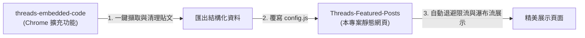
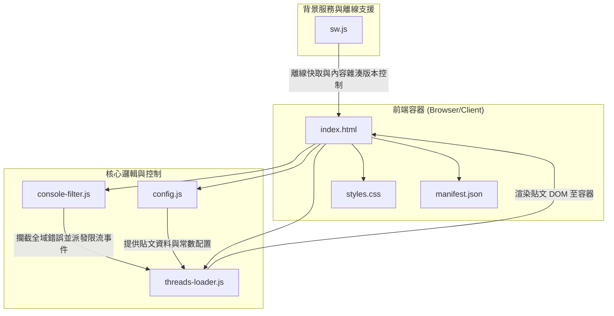

# Threads Featured Posts

[English](./README_EN.md) | 繁體中文

基於純前端技術建置之精緻、響應式且高穩定性 Threads 貼文展示與分頁瀏覽網頁應用。內建速率限制（Rate Limiting）指數退避機制、Iframe 載入錯誤攔截與優雅降級機制，並結合漸進式網頁應用（PWA）離線快取，提供順暢瀏覽體驗。

---

## 生態系與專案關聯 (Ecosystem & Integration)

本專案與 [Threads 程式碼儲存器 (threads-embedded-code)](https://github.com/Scorpio-meow/threads-embedded-code) 構成完整的 Threads 貼文收藏與展示生態系：



1. **資料收集端**：使用 [threads-embedded-code](https://github.com/Scorpio-meow/threads-embedded-code) 擴充功能於瀏覽 Threads 時捕捉貼文、自動過濾 UI 雜訊並匯出格式化資料。
2. **內容展示端**：本專案讀取 [config.js](./config.js) 資料，進行高穩定性、具備速率退避與搜尋標籤過濾之展示。

---

## 快速開始 (Quick Start)

本專案為純前端靜態專案，無需編譯或安裝複雜依賴，僅需靜態伺服器環境即可運行。

### 1. 下載專案

```bash
git clone https://github.com/Scorpio-meow/Threads-Featured-Posts.git
cd Threads-Featured-Posts
```

### 2. 配置貼文資料

將 Threads Embed Code 放進 [config.js](./config.js) 的 `posts` 陣列中。建議搭配「Threads 程式碼儲存器」瀏覽器擴充功能使用：

1. **安裝擴充功能**：
   ```bash
   git clone https://github.com/Scorpio-meow/threads-embedded-code.git
   ```
   在瀏覽器開啟 `chrome://extensions/`，啟用「開發人員模式」，並點擊「載入未封裝項目」選取資料夾。
2. **匯出貼文**：
   於擴充功能管理介面點擊「匯出」，複製資料並覆寫本專案 [config.js](./config.js) 內的 `posts` 變數。

### 3. 啟動本機開發伺服器

使用 Bun 快速啟動靜態伺服器預覽專案：

**使用 Bun 啟動（推薦）：**
```bash
bunx http-server -p 3000
```

**使用 Python 啟動（備用）：**
```bash
python -m http.server 3000
```

啟動後前往 `http://localhost:3000` 即可瀏覽。

---

## 核心功能 (Features)

- **搜尋與標籤篩選**：支援即時搜尋框，可依作者帳號、貼文內文或 Hashtag 進行模糊匹配。熱門標籤列依頻率降序排列，支援「更多/收起」切換，狀態與 URL 參數即時同步。
- **手動與系統主題切換**：可於深色與淺色模式切換，偏好記錄至 `localStorage`。深淺主題具備完整 CSS 變數系統，並自動同步 `blockquote` 之 `data-theme` 屬性。
- **版面配置切換**：提供「瀑布流 (Masonry Grid)」與「單欄列表 (List)」兩種版面。瀑布流採用原生 CSS `columns` 實現，響應式自動調整欄數。
- **自動限流與指數退避策略**：全域攔截 HTTP 429 錯誤與 Threads 腳本錯誤，觸發速率限制時自動呈現倒數計時橫幅並暫停載入，透過指數退避（Backoff）自動恢復。
- **效能優化與分塊渲染**：利用 `requestIdleCallback` 分塊渲染 DOM，先展示骨架屏 (Skeleton Screen) 搭配 shimmer 動畫佔位，確保交互回應速度。
- **確定性隨機洗牌**：支援一鍵隨機排序與重新洗牌，基於 URL `random` 參數種子，確保分頁瀏覽時文章順序一致。
- **PWA 離線支援**：利用 Service Worker 快取核心資源，提供完整 [manifest.json](./manifest.json)，支援行動與桌面端安裝獨立視窗運行。
- **高強度 Iframe 監控**：使用 `MutationObserver` 與 `ResizeObserver` 監控動態生成之 iframe。判定載入失敗或超時（低於 200px）時實施優雅降級，顯示備用連結。
- **單篇預覽模式**：支援透過 URL 參數 `post` 指定單篇貼文連結或索引進入預覽模式，自動隱藏控制列與分頁，並提供一鍵分享複製 URL。
- **貼文嵌入載入進度面板**：玻璃擬物載入進度面板，即時預估並倒數下一篇貼文載入時間、當前用時與總剩餘時間。
- **Console 雜訊過濾**：內建 [console-filter.js](./console-filter.js) 攔截器，自動遮蔽跨網域 404 資源警告與無關 postMessage 訊息。
- **常見問題與除錯模組**：頁尾整合玻璃擬物 FAQ 對話框，支援一鍵切換 `?debug=1` 偵錯模式。

---

## 配置與資料格式 (Configuration & Data Formats)

### 系統配置設定 (Configuration Settings)

於 [config.js](./config.js) 可調整以下常數：

| 配置項 | 說明 | 預設值 |
| :--- | :--- | :---: |
| `LOAD_DELAY` | 指數退避解除或遭遇限流時之基礎等待時間 (ms，安全底線為 4000ms) | `4000` |
| `BATCH_SIZE` | 小批次併發載入上限 (安全上限為 1，符合官方限制) | `1` |
| `EMBED_STAGGER_DELAY` | 同一批次內相鄰兩篇貼文開始載入間隔 (ms，安全底線為 3600ms) | `3600` |
| `IFRAME_TIMEOUT` | 單個 iframe 載入超時時間 (ms) | `3600` |
| `MIN_IFRAME_TIMEOUT` | 早期 iframe 存在性檢查門檻 (ms) | `8000` |
| `RATE_LIMIT_BACKOFF` | 遭遇限流 (429) 之基礎退避時間 (ms，1.5 倍指數遞增，上限 300 秒) | `60000` |
| `MAX_DELAY` | 動態延遲時間上限 (ms) | `60000` |
| `MIN_DELAY_BETWEEN_REQUESTS` | 相鄰請求間最小安全等待間隔 (ms) | `3600` |
| `MAX_VISIBLE_QUEUE` | 瀏覽器中最大渲染貼文卡片數量上限 (防止記憶體過載) | `30` |
| `PAGE_SIZE_OPTIONS` | 每頁顯示筆數選項陣列 | `[1, 3, 5, 10, 25, 50]` |
| `PAGE_SIZE` | 預設每頁顯示筆數 | `10` |

### 貼文資料格式 (Data Formats)

[config.js](./config.js) 中的 `posts` 陣列支援兩種格式：

#### 格式一：純 HTML 字串

```javascript
const posts = [
    '<blockquote class="text-post-media" data-text-post-permalink="https://...">...</blockquote>',
];
```

#### 格式二：結構化物件（推薦）

```javascript
const posts = [
    {
        embedCode: '<blockquote class="text-post-media" ...>...</blockquote>',
        postLink: 'https://www.threads.net/@username/post/xxx',
        author: 'username',
        content: '貼文內文...',
        tags: ['標籤一', '標籤二']
    },
];
```

### URL 查詢參數說明 (URL Query Parameters)

| 參數 | 說明 | 範例 |
| :--- | :--- | :--- |
| `page` | 目標顯示頁碼 | `?page=2` |
| `page_size` | 每頁顯示筆數 | `?page_size=25` |
| `random` | 隨機排序種子值 (時間戳記) | `?random=1717750000000` |
| `search` | 搜尋關鍵字 (對應帳號、內文、標籤) | `?search=技術` |
| `tag` | 精確標籤篩選 (不含 `#`) | `?tag=程式` |
| `post` | 單篇預覽模式 (`postLink` 或索引) | `?post=https://www.threads.net/@username/post/xxx` |
| `debug` | 設定為 `1` 時顯示完整日誌與跨域錯誤 | `?debug=1` |

---

## 系統架構與技術細節 (Architecture & Technical Details)

### 技術棧 (Tech Stack)

| 分類 | 技術描述 |
| :--- | :--- |
| **前端核心** | 原生 HTML5, CSS3, Vanilla JavaScript (ES5/ES6 相容) |
| **外部依賴** | 零外部框架依賴 (Zero dependencies) |
| **字體與樣式** | Google Fonts (Manrope, Noto Sans TC), CSS 變數設計系統, 玻璃擬物, CSS `columns` 瀑布流 |
| **離線與 PWA** | Service Worker API, Cache Storage, Web App Manifest |
| **部署環境** | 任何靜態 Web 伺服器 (如 GitHub Pages, Vercel, Netlify) |

### 檔案與組件關係圖



---

## 授權條款 (License)

[MIT License](./LICENSE)