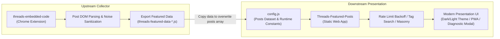
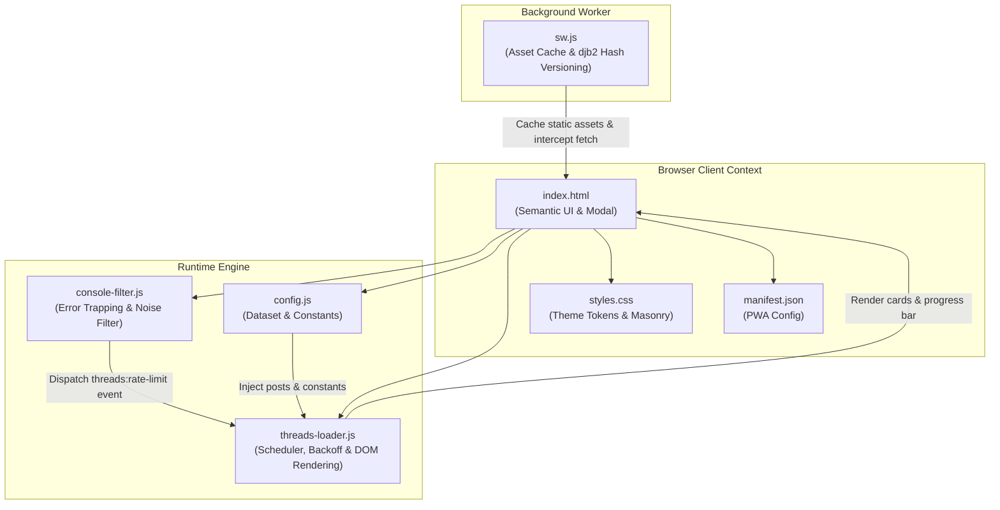
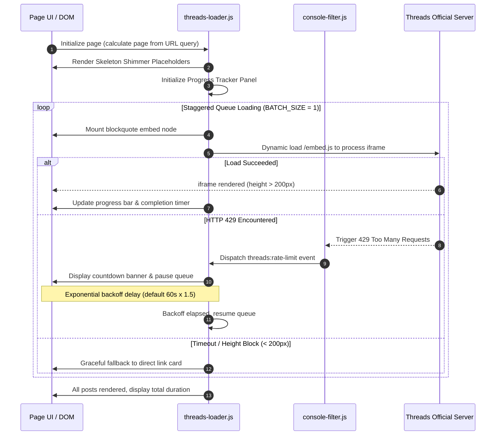

<div align="center">

# Threads Featured Posts

**Pure front-end web application for displaying, paginating, and organizing featured Threads posts with multi-column masonry layouts and automated rate-limiting protection**

[](./LICENSE)
[](./manifest.json)
[](#tech-stack--specifications)
[](#tech-stack--specifications)
[](https://github.com/Scorpio-meow/threads-embedded-code)

---

English | [繁體中文](./README.md)

Pure front-end vanilla architecture, zero heavy external frameworks, ready out of the box.  
Equipped with HTTP 429 rate-limiting exponential backoff, iframe rendering anomaly monitoring with graceful fallback, deterministic seeded shuffling,  
and Progressive Web App (PWA) offline caching for a seamless browsing and searching experience.

</div>

---

## Table of Contents

- [Project Overview & Core Values](#project-overview--core-values)
- [Ecosystem & Integration](#ecosystem--integration)
- [Quick Start](#quick-start)
  - [Prerequisites & Environment](#prerequisites--environment)
  - [1. Clone Repository](#1-clone-repository)
  - [2. Configure Post Data](#2-configure-post-data)
  - [3. Start Local Development Server](#3-start-local-development-server)
- [Core Features](#core-features)
  - [1. Real-Time Search & Tag Filtering](#1-real-time-search--tag-filtering)
  - [2. Dual Theme System & CSS Design Tokens](#2-dual-theme-system--css-design-tokens)
  - [3. Responsive CSS Masonry & Single-Column Layout](#3-responsive-css-masonry--single-column-layout)
  - [4. Automated Rate-Limiting Detection & Exponential Backoff](#4-automated-rate-limiting-detection--exponential-backoff)
  - [5. Chunked Non-Blocking Rendering & Shimmer Skeletons](#5-chunked-non-blocking-rendering--shimmer-skeletons)
  - [6. Deterministic Seeded Random Shuffling](#6-deterministic-seeded-random-shuffling)
  - [7. PWA Support & 32-bit djb2 Content Hash Caching](#7-pwa-support--32-bit-djb2-content-hash-caching)
  - [8. Iframe Health Observer & Graceful Fallback](#8-iframe-health-observer--graceful-fallback)
  - [9. Single Post Isolated Preview Mode](#9-single-post-isolated-preview-mode)
  - [10. Glassmorphism Loading Progress Panel](#10-glassmorphism-loading-progress-panel)
  - [11. Global Console Noise Filter](#11-global-console-noise-filter)
  - [12. FAQ & Diagnostic Accordion Modal](#12-faq--diagnostic-accordion-modal)
- [Tech Stack & Specifications](#tech-stack--specifications)
- [Project Directory & File Structure](#project-directory--file-structure)
  - [File Listing](#file-listing)
  - [Module Responsibilities](#module-responsibilities)
- [System Architecture & Lifecycle Flows](#system-architecture--lifecycle-flows)
  - [System Module Architecture Diagram](#system-module-architecture-diagram)
  - [Post Load & Rate-Limiting Sequence Diagram](#post-load--rate-limiting-sequence-diagram)
- [Configuration & Data Specifications](#configuration--data-specifications)
  - [Runtime Configuration Table (RuntimeConfig)](#runtime-configuration-table-runtimeconfig)
  - [Post Data Schema (PostItem)](#post-data-schema-postitem)
  - [URL Query Parameters Specification (URLParams)](#url-query-parameters-specification-urlparams)
- [Key Algorithms & Technical Deep Dive](#key-algorithms--technical-deep-dive)
  - [1. Exponential Backoff Rate-Limiting Algorithm](#1-exponential-backoff-rate-limiting-algorithm)
  - [2. 32-bit djb2 Content Hash Cache Invalidation](#2-32-bit-djb2-content-hash-cache-invalidation)
  - [3. Deterministic Pseudo-Random Seeded Shuffle](#3-deterministic-pseudo-random-seeded-shuffle)
  - [4. Dual Iframe Observers & Fallback Substitution](#4-dual-iframe-observers--fallback-substitution)
- [FAQ & Troubleshooting](#faq--troubleshooting)
- [Development & Deployment Guide](#development--deployment-guide)
  - [Local Development Commands](#local-development-commands)
  - [Static Hosting Deployment](#static-hosting-deployment)
- [Changelog](#changelog)
- [AI-Friendly Documentation (llm.txt)](#ai-friendly-documentation-llmtxt)
- [License & Disclaimer](#license--disclaimer)

---

## Project Overview & Core Values

Official Threads embed iframes provide rich social interactivity. However, when rendering multiple embeds simultaneously, web pages frequently suffer from cross-origin authentication failures, HTTP 429 rate-limiting (Too Many Requests), main-thread blocking, and layout jitter.

**Threads Featured Posts** is engineered to eliminate these bottlenecks:

| Core Value | Description |
| :--- | :--- |
| **Resilient Rate-Limit Defense** | Automatically catches HTTP 429 errors, pauses the loading queue with an exponential backoff countdown, and resumes automatically without page reloads. |
| **Graceful Degradation Guarantee** | Seamlessly substitutes broken or blocked iframes (height under 200px) with fallback author cards and direct links. |
| **Smooth Chunked Rendering** | Leverages `requestIdleCallback` and shimmer skeleton animations to ensure non-blocking DOM mounting, maintaining optimal INP metrics. |
| **Instant Search & Tag Filtering** | Fast real-time fuzzy search matching authors, content, and hashtags with two-way URL query synchronization. |
| **Offline Cache & PWA** | Automated version invalidation via 32-bit djb2 content hashing, supporting full standalone app installation on desktop and mobile. |

---

## Ecosystem & Integration

This project acts as the **Presentation Layer (Downstream)** in tandem with the companion Chrome extension **[Threads Code Saver (threads-embedded-code)](https://github.com/Scorpio-meow/threads-embedded-code)**:



1. **Upstream Collector**: Use [threads-embedded-code](https://github.com/Scorpio-meow/threads-embedded-code) to bookmark posts while browsing Threads, clicking "Export Featured Data" to produce structured objects without the `@` prefix.
2. **Downstream Viewer**: Paste the exported array into [config.js](./config.js) in this project to instantly update your showcase site.

---

## Quick Start

### Prerequisites & Environment

- Any modern browser supporting modern web standards (Chrome, Edge, Safari, Firefox, Brave, Arc, etc.).
- A local or remote static web server (Bun, Node.js, Python, or static hosting providers).
- Zero compilation steps, zero bundlers, zero npm runtime dependencies.

### 1. Clone Repository

```bash
git clone https://github.com/Scorpio-meow/Threads-Featured-Posts.git
cd Threads-Featured-Posts
```

### 2. Configure Post Data

Open [config.js](./config.js) and update the `posts` array:

```javascript
const posts = [
    {
        embedCode: '<blockquote class="text-post-media" data-text-post-permalink="https://www.threads.com/@username/post/xxx">...</blockquote>',
        postLink: 'https://www.threads.com/@username/post/xxx',
        author: 'username',
        content: 'Plain text content of the post...',
        tags: ['JavaScript', 'WebDev']
    }
];
```

### 3. Start Local Development Server

You can choose any of the following methods to preview the project locally:

**Method A: VS Code / IDE "Live Server" Extension (Easiest)**
- Install the "Live Server" extension in VS Code.
- Right-click `index.html` and select "**Open with Live Server**" (default: `http://127.0.0.1:5500`).

**Method B: Start with Bun (Recommended CLI)**
```bash
bunx http-server -p 3000
```
Open `http://localhost:3000` in your browser.

**Method C: Start with Python (Fallback CLI)**
```bash
python -m http.server 3000
```

---

## Core Features

### 1. Real-Time Search & Tag Filtering
- **Real-Time Fuzzy Matching**: Instantly searches author handles, post text, and hashtags as you type.
- **Frequency-Sorted Tag Bar**: Automatically ranks tags by frequency in descending order with expand/collapse toggle support.
- **Two-Way URL State Sync**: Search terms (`?search=`) and active tags (`?tag=`) synchronize with URL query parameters for direct link sharing and bookmarking.

### 2. Dual Theme System & CSS Design Tokens
- **Dark / Light Mode Switching**: Instant header toggle with preference persistence in `localStorage`.
- **Threads Embed Theme Sync**: Dynamically updates the `data-theme` attribute on all rendered `blockquote` elements upon theme switching.
- **Centralized CSS Variables**: Palette, typography, border radiuses, and glassmorphism styling are managed via CSS Custom Properties in `styles.css`.

### 3. Responsive CSS Masonry & Single-Column Layout
- **Native CSS `columns` Masonry**: Employs CSS multi-column layouts to eliminate JavaScript reflow lag, dynamically adapting from 3 columns (desktop) to 2 columns (tablet) and 1 column (mobile).
- **Single-Column Focus Mode**: One-click toggle in the toolbar to switch to a centered list view for in-depth code reading.

### 4. Automated Rate-Limiting Detection & Exponential Backoff
- **HTTP 429 Error Interception**: `console-filter.js` traps official script 429 warnings and dispatches global custom events.
- **Countdown Banner & Queue Pause**: Renders a live countdown banner on the progress panel and halts subsequent embed rendering.
- **Exponential Scaling**: Starts with a base 60-second backoff, scaling 1.5x on consecutive occurrences (up to 300s ceiling), safely resuming after timer expiry.

### 5. Chunked Non-Blocking Rendering & Shimmer Skeletons
- **requestIdleCallback Scheduling**: Mounts post card DOM elements during browser idle periods to prevent main-thread UI jank and improve Interaction to Next Paint (INP).
- **Shimmer Placeholder Animations**: Displays smooth skeleton placeholders prior to embed resolution.

### 6. Deterministic Seeded Random Shuffling
- **Timestamp Seed Generation**: Generates a timestamp seed stored in the URL (`?random=<seed>`).
- **Pagination & Refresh Consistency**: Uses a seeded pseudo-random formula ensuring identical post ordering across pagination clicks and browser reloads.

### 7. PWA Support & 32-bit djb2 Content Hash Caching
- **Progressive Web App**: Complete with `manifest.json` and Service Worker for desktop and mobile home screen installation.
- **Automatic djb2 Cache Invalidation**: The Service Worker reads core source files and hashes their content using a 32-bit djb2 algorithm, automatically clearing stale caches when code changes.

### 8. Iframe Health Observer & Graceful Fallback
- **MutationObserver + ResizeObserver**: Monitors iframe generation and rendered height.
- **Automated Fallback**: If an iframe fails to render, times out (exceeding `IFRAME_TIMEOUT`), or stays under 200px in height, it is replaced with a fallback card containing author info and a direct Threads link.

### 9. Single Post Isolated Preview Mode
- **Direct URL Parameter Routing**: Navigate via `?post=<URL>` or `?post=<Index>` to isolate an individual post while hiding header controls, tag bars, and pagination.
- **One-Click Share URL**: Built-in button to copy the direct sharing link.

### 10. Glassmorphism Loading Progress Panel
- **Telemetry Metrics**: Shows overall page load percentage, current post duration, next post countdown, and estimated total remaining duration.
- **Glassmorphism Aesthetic**: Modern frosted glass backdrop that remains visually unobtrusive.

### 11. Global Console Noise Filter
- **Noise Suppression**: `console-filter.js` filters out cross-origin 404 warnings, missing favicon alerts, and irrelevant postMessage events emitted by Meta embed scripts.

### 12. FAQ & Diagnostic Accordion Modal
- **Embedded FAQ Dialog**: Accordion modal covering login authentication, Do Not Track issues, and rate limit best practices.
- **One-Click Debug Mode**: Toggle `?debug=1` directly from the UI to unmask all console warnings and timing logs.

---

## Tech Stack & Specifications

```
+-----------------------------------------------------------------------+
|                         Technical Standards                           |
+-----------------------------------------------------------------------+
|  Frontend Core    | Vanilla JavaScript (ES6+), HTML5, CSS3 Variables  |
|  Typography       | Google Fonts (Manrope, Noto Sans TC)              |
|  Layout Engine    | Native CSS Columns Masonry + CSS Grid + Flexbox   |
|  Offline Cache    | Service Worker API (32-bit djb2 Auto Invalidation)|
|  App Delivery     | Progressive Web App (Web App Manifest)            |
|  Dependencies     | 0 External Runtime Dependencies                   |
|  Hosting Target   | Any static web host (GitHub Pages, Vercel, etc.)  |
+-----------------------------------------------------------------------+
```

---

## Project Directory & File Structure

### File Listing

```
Threads-Featured-Posts/
├── index.html            # Main semantic HTML structure & modals
├── config.js             # Posts dataset (posts array) & runtime constants
├── threads-loader.js     # Core runtime controller (queue, backoff, DOM, metrics)
├── console-filter.js     # Error interceptor (suppress 404 noise, trap 429 events)
├── styles.css            # Design token system (CSS variables, masonry, themes)
├── sw.js                 # PWA Service Worker (djb2 hash invalidation, offline cache)
├── manifest.json         # PWA Manifest specification
├── assets/               # Static icon assets (Favicon, App Icons)
├── llm.txt               # AI-friendly architecture & RAG indexing specification
├── README_EN.md          # English documentation (This file)
└── README.md             # Traditional Chinese documentation
```

### Module Responsibilities

| File Path | Layer | Key Responsibilities |
| :--- | :--- | :--- |
| `index.html` | View Layer | Declares semantic HTML layout, search inputs, theme toggles, pagination, and modals. |
| `config.js` | Data & Config Layer | Stores the posts dataset array and 11 runtime configuration constants. |
| `threads-loader.js` | Controller Layer | Manages URL routing, pagination, queue scheduling, backoff timers, DOM rendering, and fallbacks. |
| `console-filter.js` | Interceptor Layer | Intercepts console logs, suppresses 404 warnings, and fires rate-limit custom events. |
| `styles.css` | Styling Layer | Defines CSS custom properties, dark/light themes, masonry columns, and animations. |
| `sw.js` | Service Worker Layer | Implements djb2 hash versioning for cache busting and offline asset serving. |
| `llm.txt` | AI Specification Layer | Provides structured project metadata and algorithm specifications for AI agents. |

---

## System Architecture & Lifecycle Flows

### System Module Architecture Diagram



### Post Load & Rate-Limiting Sequence Diagram



---

## Configuration & Data Specifications

### Runtime Configuration Table (RuntimeConfig)

Customizable constants in [config.js](./config.js):

| Setting Constant | Type | Default | Description & Best Practice |
| :--- | :---: | :---: | :--- |
| `LOAD_DELAY` | number | `4000` | Base load delay between embed requests (ms). Maintain >= 4000ms. |
| `BATCH_SIZE` | number | `1` | Maximum concurrent iframe loads. Keep at 1 to prevent 429 rate limits. |
| `EMBED_STAGGER_DELAY` | number | `3600` | Stagger interval between adjacent embed loads (ms). Safety threshold: 3600ms. |
| `IFRAME_TIMEOUT` | number | `3600` | Timeout threshold for individual iframe renders (ms). Triggers fallback on expiry. |
| `MIN_IFRAME_TIMEOUT` | number | `8000` | Initial presence check safety duration (ms). |
| `RATE_LIMIT_BACKOFF` | number | `60000` | Base backoff on 429 error (ms). Escalates by 1.5x up to 300s ceiling. |
| `MAX_DELAY` | number | `60000` | Upper ceiling for dynamic delay calculation (ms). |
| `MIN_DELAY_BETWEEN_REQUESTS` | number | `3600` | Minimum safety interval between consecutive requests (ms). |
| `MAX_VISIBLE_QUEUE` | number | `30` | Maximum post DOM elements retained in active memory. |
| `PAGE_SIZE_OPTIONS` | number[] | `[1, 3, 5, 10, 25, 50]` | Selectable options in the page size dropdown. |
| `PAGE_SIZE` | number | `10` | Default number of items rendered per page. |

### Post Data Schema (PostItem)

TypeScript interface for items in the `posts` array:

```typescript
interface PostItem {
  /** Threads official blockquote HTML string */
  embedCode: string;

  /** Full original URL to the Threads post */
  postLink: string;

  /** Author username handle without @ */
  author: string;

  /** Plaintext post content */
  content: string;

  /** Array of hashtag keywords */
  tags: string[];
}
```

### URL Query Parameters Specification (URLParams)

| Parameter | Type | Example | Description |
| :--- | :---: | :--- | :--- |
| `page` | integer | `?page=2` | Target page index (1-based). |
| `page_size` | integer | `?page_size=25` | Number of items per page. |
| `random` | string | `?random=1717750000000` | Timestamp seed for deterministic random shuffle. |
| `search` | string | `?search=frontend` | Search keyword matching author, content, or tags. |
| `tag` | string | `?tag=React` | Exact hashtag filter (excluding `#`). |
| `post` | string | `?post=https://www.threads.com/@username/post/xxx` | Single post preview mode (URL or index). |
| `debug` | string | `?debug=1` | Enable debug logging in console. |

---

## Key Algorithms & Technical Deep Dive

### 1. Exponential Backoff Rate-Limiting Algorithm

When Meta returns HTTP 429, the system halts queue execution and computes escalating delays:

```javascript
function handleRateLimitDetected(detail) {
  rateLimitDetected = true;
  var backoffDuration = currentBackoff; // Default 60000ms
  rateLimitEndTime = Date.now() + backoffDuration;
  
  // Exponentially scale subsequent backoff (capped at 300s)
  currentBackoff = Math.min(MAX_BACKOFF_CEILING, currentBackoff * 1.5);
  
  createOrUpdateProgressPanel();
  setTimeout(function() {
    rateLimitDetected = false;
    resumeQueueProcessing();
  }, backoffDuration);
}
```

### 2. 32-bit djb2 Content Hash Cache Invalidation

In `sw.js`, a 32-bit hash is computed across core source files:

```javascript
function djb2Hash(str) {
  let hash = 5381;
  for (let i = 0; i < str.length; i++) {
    hash = ((hash << 5) + hash) ^ str.charCodeAt(i);
    hash = hash & hash; // Convert to 32-bit integer
  }
  return (hash >>> 0).toString(16);
}
```

### 3. Deterministic Pseudo-Random Seeded Shuffle

Ensures consistent post ordering across page reloads and pagination:

```javascript
function seededRandom(seed) {
  var x = Math.sin(seed++) * 10000;
  return x - Math.floor(x);
}
function shuffleArrayWithSeed(array, seed) {
  var m = array.length, t, i;
  var currentSeed = parseInt(seed, 10) || 1;
  while (m) {
    i = Math.floor(seededRandom(currentSeed++) * m--);
    t = array[m];
    array[m] = array[i];
    array[i] = t;
  }
  return array;
}
```

### 4. Dual Iframe Observers & Fallback Substitution

To handle blocked iframes without breaking page layouts:

1. **MutationObserver** traps iframe creation inside embed wrappers.
2. **ResizeObserver** monitors rendered height; if height remains under 200px upon timeout, it is swapped for a graceful fallback card.

---

## FAQ & Troubleshooting

> [!WARNING]
> **Issue 1: Why do some post cards only display a "View on Threads" button?**
> - This is caused by Threads' cross-origin anti-scraping protections.
> - Ensure your browser is logged into [Threads](https://www.threads.com/).
> - Disable "Do Not Track" in browser privacy settings (it blocks Meta embed authentication cookies).
> - Whitelist `cdninstagram.com` and `threads.com` in ad blockers (e.g. uBlock Origin).

> [!NOTE]
> **Issue 2: What is "Rate Limiting" and how does the application handle it?**
> - Rapid embed requests trigger HTTP 429 from Meta.
> - The application automatically displays a countdown banner, pauses the queue, and resumes after exponential backoff.
> - To minimize rate limits, decrease `PAGE_SIZE` (e.g. 3 or 5) or increase `LOAD_DELAY` and `EMBED_STAGGER_DELAY` in [config.js](./config.js).

> [!TIP]
> **Issue 3: How to enable debug mode?**
> - Append `?debug=1` to the URL (e.g., `http://localhost:3000/?debug=1`).
> - Unmasked cross-origin warnings and scheduling diagnostics will display in the developer console (F12).

---

## Development & Deployment Guide

### Local Development Commands

Pure front-end static architecture with zero build steps:

```bash
# Clone repository
git clone https://github.com/Scorpio-meow/Threads-Featured-Posts.git
cd Threads-Featured-Posts
```

**Server Execution Options:**
1. **VS Code / IDE Live Server**: Right-click `index.html` and select "Open with Live Server".
2. **Bun Static Server**:
   ```bash
   bunx http-server -p 3000
   ```
3. **Python Static Server**:
   ```bash
   python -m http.server 3000
   ```

### Static Hosting Deployment

Deploy directly to any static web host:

- **GitHub Pages**: Set repository Settings -> Pages to deploy from root of `main` branch.
- **Cloudflare Pages**: Connect Git repository, leave Build command empty, set Output directory to `/`.
- **Vercel / Netlify**: Drag-and-drop folder or connect Git repository for instant deployment.

---

## Changelog

Follows the [Keep a Changelog](https://keepachangelog.com/en/1.0.0/) format.

### [Unreleased]

#### Added
- Comprehensive Exponential Rate-Limiting Backoff defense against HTTP 429 limits.
- Glassmorphism loading progress tracker showing percentage, elapsed time, and ETA.
- 32-bit djb2 content hash automated Service Worker cache invalidation.
- Single post isolated preview mode (`?post=`) and deterministic seeded shuffle (`?random=`).
- Footer FAQ accordion diagnostic modal.

#### Changed
- Refactored masonry layout to native CSS `columns` for smoother scrolling performance.
- Upgraded dual theme system with dynamic CSS custom properties and `blockquote` `data-theme` synchronization.
- Enhanced `console-filter.js` interceptors to suppress 404 noise and cross-origin postMessage warnings.

#### Fixed
- Removed forced minimum height constraints for embedded posts on mobile viewports for cleaner presentation.
- Fixed abnormal bottom whitespace margin in single post isolated preview mode.

#### Security
- Resolved CodeQL static analysis alerts for DOM XSS by sanitizing dynamic text nodes and using safe property assignments.
- Fixed XSS vulnerability in `threads-loader.js` caused by re-parsing DOM text nodes as raw HTML.

---

## AI-Friendly Documentation (llms.txt / llm.txt)

This project provides standardized **[llms.txt](./llms.txt)** (and backward-compatible **[llm.txt](./llm.txt)**) files designed for AI agents, LLM search engines, and RAG indexing pipelines:

- File location: `llms.txt` / `llm.txt`
- Contents: System architecture, runtime configuration schema, data models, and detailed algorithm specifications.

---

## License & Disclaimer

### License

This project is licensed under the **[MIT License](./LICENSE)**. You are free to use, modify, distribute, and integrate it into private or commercial projects.

### Disclaimer

This is an independent open-source project and is not affiliated with, authorized, or endorsed by Meta or Threads. Intellectual property rights for embedded content belong to their respective authors and Meta.

---

<div align="center">

**Threads Featured Posts**  
Developed and maintained by [Scorpio-meow](https://github.com/Scorpio-meow)

</div>