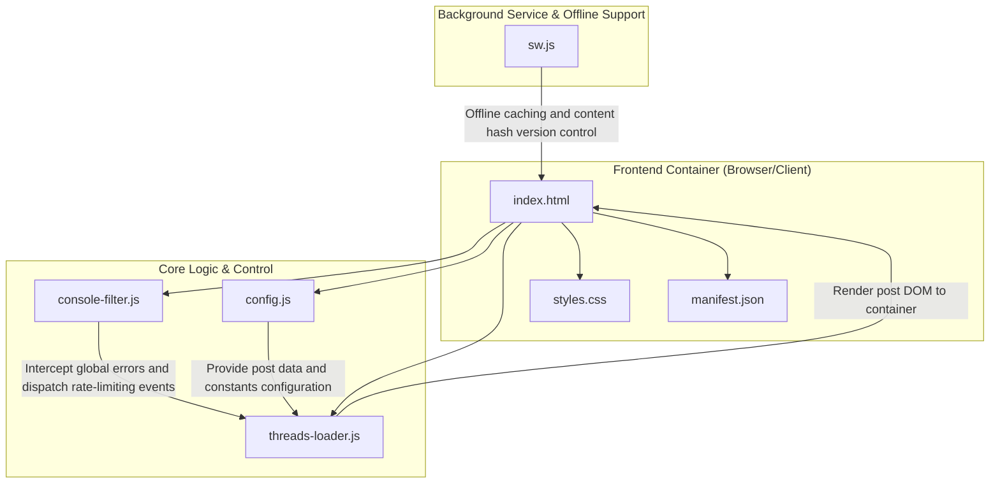
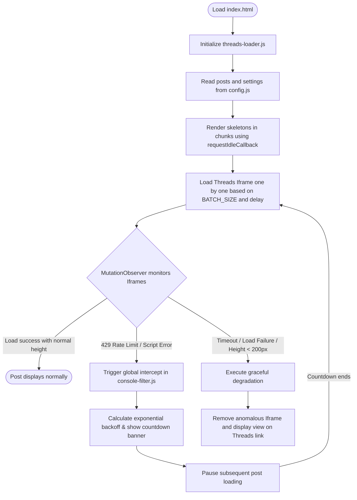

# Threads Featured Posts

English | [繁體中文](./README.md)

This is an elegant, responsive, and highly stable web application built using pure front-end technologies for displaying and paginating Threads posts. The project features a robust rate-limiting backoff mechanism, iframe load error interception with graceful degradation, and Progressive Web App (PWA) offline caching to deliver a seamless and fluid user experience.

---

## Quick Start

This is a pure front-end static project with no compilation or complex dependencies. You only need a static file environment to run it.

### 1. Clone Project

```bash
git clone https://github.com/Scorpio-meow/Threads-Featured-Posts.git
cd Threads-Featured-Posts
```

### 2. Configure Post Data

You can manually place the Embed Code obtained from the official Threads site into the `posts` array in [config.js](./config.js). However, for efficiency, it is highly recommended to use the companion Chrome extension "Threads Embed Code Saver":

1. **Install Threads Embed Code Saver**:
   This is a dedicated browser extension that lets you capture and manage Threads posts with one click while browsing.
   ```bash
   git clone https://github.com/Scorpio-meow/threads-embedded-code.git
   ```
   - Go to your browser's extension management page (e.g., `chrome://extensions/`) and enable "Developer mode".
   - Click "Load unpacked" and select the cloned `threads-embedded-code` folder.

2. **Export Posts and Overwrite Config**:
   After capturing posts using the extension, click "Export" in the extension management panel, copy the exported structured HTML array data, and overwrite the `posts` variable in this project's [config.js](./config.js).

### 3. Start Local Development Server

It is recommended to use Bun to quickly launch a static web server to preview the project:

**Start with Bun (Recommended):**
```bash
bunx http-server -p 3000
```

**Start with Python (Fallback):**
```bash
python -m http.server 3000
```

Once started, open your browser and navigate to `http://localhost:3000` to view the application.

---

## Features

- **Search & Tag Filtering**: Real-time search inputs combined with a search button allow fuzzy matching by author name, post content, or hashtag. The top header has a tag filtering bar sorted in descending order of frequency, displaying the top 10 tags by default. A 'More/Less' toggle button expands the complete list. All filtering states are synchronized with URL query parameters in real time.
- **Theme Switching (Manual & System)**: The control panel features a button to toggle manually between Dark and Light mode. The user's choice is saved in `localStorage`. Synced Embed Styling dynamically updates the `data-theme` attribute on blockquotes to synchronize styling with the official Threads embed.
- **Layout Customization**: Users can switch between a multi-column 'Masonry Grid' and a 'List' layout. Masonry mode uses native CSS `columns`, showing multiple columns on wide screens and scaling down to a single column on mobile. The choice is saved to `localStorage`.
- **Automatic Rate Limiting & Exponential Backoff**: Intercepts HTTP 429 errors and Threads official script errors globally. If rate limiting is triggered, a countdown banner is displayed, subsequent post loading is paused, and loading automatically resumes after the dynamically computed exponential backoff time. Parses the `Retry-After` header to set precise backoff times.
- **Performance Optimization & Chunked Rendering**: Uses `requestIdleCallback` to append DOM elements in chunks. It shows a shimmer-animated skeleton screen placeholder first, avoiding blocking the main thread. If any chunk's DOM operations exceed 16ms, subsequent chunk sizes are scaled down proportionally to preserve INP responsiveness.
- **Deterministic Seeded Shuffle**: Supports toggling between default and random order. In random mode, a 'Reshuffle' button regenerates the random seed. Seeded random sorting relies on a URL `random` parameter to ensure the post order remains consistent when navigating pages.
- **PWA Offline Support**: Service Worker caches critical assets for offline accessibility. A configured [manifest.json](./manifest.json) enables desktop/mobile app installation with a standalone window interface. Cache versioning checks content hashes, updating automatically when any core asset changes.
- **Robust Iframe Monitoring**: A `MutationObserver` watches the post container to catch iframes created by `embed.js`. It binds `load` and `error` events to detect errors. Tracks the height via `ResizeObserver`; if the iframe remains under 200px or fails to load within `IFRAME_TIMEOUT`, it replaces the iframe with a backup 'View this post on Threads' link.
- **Single Post Preview**: Using the `post` query parameter, the application enters a single post preview, hiding controls, tags, and pagination. Hovering on cards displays a permalink copy button. Clicking the share button copies the dedicated single-post URL to the clipboard.
- **Loading Progress Panel**: Displays an elegant glassmorphism loading progress panel below the top pagination bar, containing loading percentages and a dynamic progress bar. Estimates and counts down when the next post will start embedding, current post loading time, estimated remaining duration, and total loading duration.
- **Automatic Console Noise Filtering**: [console-filter.js](./console-filter.js) silences cross-origin postMessage warnings, missing `favicon.ico` errors, and Instagram CDN 404s thrown by Threads' official embed script, converting specific errors into custom events.
- **FAQ & Debugging Modal**: A modal dialogue at the footer displays a stylish accordion-style FAQ. It features a toggle debugging mode button that adds `?debug=1` to the URL for quick diagnostics.

---

## Configuration & Data Formats

### Configuration Settings

You can adjust these constants at the top of [config.js](./config.js) to fine-tune the application:

| Setting | Description | Default |
| :--- | :--- | :---: |
| `LOAD_DELAY` | Base delay (ms) for iframe loading when resuming after rate limiting or standard loads (**internally bounded to a minimum of 4000ms**) | `4000` |
| `BATCH_SIZE` | Maximum concurrent iframe loads allowed (**internally capped at 1** to strictly comply with official rate limits) | `1` |
| `EMBED_STAGGER_DELAY` | Stagger delay (ms) between starting adjacent iframe loads in the same batch (**internally bounded to a minimum of 3600ms**) | `3600` |
| `IFRAME_TIMEOUT` | Timeout duration (ms) for a single iframe load | `3600` |
| `MIN_IFRAME_TIMEOUT` | Time threshold (ms) to run the first presence check for an iframe element | `8000` |
| `RATE_LIMIT_BACKOFF` | Base backoff time (ms) when hitting 429 rate limit (escalates by 1.5x, max 300s) | `60000` |
| `MAX_DELAY` | Upper limit (ms) for dynamic load delay | `60000` |
| `MIN_DELAY_BETWEEN_REQUESTS` | Minimum safety delay (ms) required between consecutive embed requests | `3600` |
| `MAX_VISIBLE_QUEUE` | Limits the maximum number of loaded/rendered post cards in the DOM to prevent memory leaks | `30` |
| `PAGE_SIZE_OPTIONS` | Allowed options for page size selections | `[1, 3, 5, 10, 25, 50]` |
| `PAGE_SIZE` | Default number of posts shown per page (must be an option in `PAGE_SIZE_OPTIONS`) | `10` |

### Data Formats

The `posts` array in [config.js](./config.js) supports two formats:

#### Format 1: Pure HTML String

```javascript
const posts = [
    '<blockquote class="text-post-media" data-text-post-permalink="https://...">...</blockquote>',
    // ...
];
```

> [!WARNING]
> The system dynamically parses the DOM to extract authors, content, and tags. This can be incomplete due to HTML structural differences and reduces search and tag matching performance.

#### Format 2: Structured Object (Recommended)

```javascript
const posts = [
    {
        embedCode: '<blockquote class="text-post-media" ...>...</blockquote>',
        postLink: 'https://www.threads.net/@username/post/xxx',
        author: 'username',
        content: 'Post content here...',
        tags: ['Tag1', 'Tag2']
    },
    // ...
];
```

> [!NOTE]
> Explicitly defining properties yields the best search and tag matching performance. This format is automatically exported by the "Threads Embed Code Saver" extension.

### URL Query Parameters

The application syncs state with URL query parameters:

| Parameter | Description | Example |
| :--- | :--- | :--- |
| `page` | The current page number. | `?page=2` |
| `page_size` | The page size (must match options in [config.js](./config.js)). | `?page_size=25` |
| `random` | The random seed value (timestamp) used to enable deterministic random shuffles. | `?random=1717750000000` |
| `search` | The search keyword for fuzzy matching against authors, content, and tags. | `?search=tech` |
| `tag` | The tag filter (case-sensitive, excludes the `#` prefix). | `?tag=programming` |
| `post` | Single post preview route. Takes a post link (`postLink`) or index number. | `?post=https://www.threads.net/@username/post/xxx` |
| `debug` | Set to `1` to disable [console-filter.js](./console-filter.js) and output raw cross-origin logs. | `?debug=1` |

---

## Architecture & Technical Details

### Tech Stack

| Category | Description |
| :--- | :--- |
| **Front-end Core** | Pure HTML5, CSS3, Vanilla JavaScript (ES5/ES6 compatible) |
| **Framework Dependency** | Zero external framework dependencies |
| **Font System** | Manrope & Noto Sans TC (Google Fonts, with preconnect optimization) |
| **Styling System** | Modern native CSS (CSS variables design system, glassmorphism, shimmer loading animation, CSS Grid/Flexbox hybrid layout, CSS `columns` masonry layout, `@supports` progressive enhancement, `prefers-reduced-motion` accessibility support) |
| **Offline Technologies** | Service Worker API (Cache Storage), Web App Manifest |
| **Deployment Environment** | Supports any static web server (e.g., GitHub Pages, Vercel, Netlify) |

### File & Component Relationship Diagram



### System Flowchart



### Directory Structure

- [assets/icons/](./assets/icons/) : Icon assets directory.
  - [apple-touch-icon.png](./assets/icons/apple-touch-icon.png) : Apple touch icon (180x180).
  - [favicon.ico](./assets/icons/favicon.ico) : Legacy browser Favicon.
  - [favicon-192x192.png](./assets/icons/favicon-192x192.png) : PWA standard icon (192x192, any + maskable).
  - [favicon-512x512.png](./assets/icons/favicon-512x512.png) : PWA large icon (512x512, any + maskable).
- [config.js](./config.js) : Configuration file (posts array, pagination constants, rate limit delays).
- [console-filter.js](./console-filter.js) : Console noise filter (loaded first to intercept global errors and dispatch custom events).
- [index.html](./index.html) : Main HTML page and DOM container (includes SEO meta, PWA manifest, Google Fonts preconnect).
- [manifest.json](./manifest.json) : PWA manifest configuration (display name, colors, icons, and start URL).
- [styles.css](./styles.css) : UI stylesheets (CSS variables, dark/light themes, glassmorphism, masonry, animations, responsive breakpoints).
- [sw.js](./sw.js) : Service Worker script (content hash caching version control, Network-First strategy, offline fallbacks).
- [threads-loader.js](./threads-loader.js) : Core business logic (pagination, search, tag filtering, rate-limiting backoff, iframe monitoring, chunked rendering, theme/layout switching, permalinks, single-post preview).

### Key Technical Details

#### 1. Rate Limiting & Exponential Backoff Mechanism
The official Threads embed script can trigger client-side rate limits (HTTP 429 Too Many Requests) when loading many posts simultaneously. This project resolves this issue using the following strategies:
- **Small Batch Concurrency & Safety Overrides**: Instead of loading the entire page at once, the system supports a configurable `BATCH_SIZE` and `EMBED_STAGGER_DELAY` in [config.js](./config.js). However, to strictly comply with the official Threads oEmbed API limit of 1,000 requests per hour (average 3.6s intervals), the engine [threads-loader.js](./threads-loader.js) internally enforces key safe bounds: `BATCH_SIZE` is capped at `1` (sequential loading), `EMBED_STAGGER_DELAY` is bounded to at least `3600` ms (3.6 seconds), the base `LOAD_DELAY` is capped at least `4000` ms (4 seconds), and the minimum safety delay between requests `MIN_DELAY_BETWEEN_REQUESTS` is capped at least `3600` ms. A random jitter is also added to prevent request synchronization.
- **Global Interception**: The system overrides `window.fetch` and `XMLHttpRequest.prototype.send` in [threads-loader.js](./threads-loader.js), and listens to `window.onerror` and `window.onunhandledrejection` to capture errors containing `429`, `rate limit`, or `Too Many Requests`. It also listens for the `threads:rate-limit` custom event dispatched by [console-filter.js](./console-filter.js).
- **Retry-After Header Parsing**: When a 429 response is intercepted, the system attempts to read the `Retry-After` header to align the backoff delay with the server's recommendation.
- **Exponential Backoff**: When a rate limit is detected, the system immediately pauses subsequent post loading and clears the iframe currently attempting to load; calculates the backoff duration based on the number of consecutive errors: `Math.min(RATE_LIMIT_BACKOFF * Math.pow(1.5, errors - 1), 300000ms)`; inserts a countdown banner at the top of `#posts-container`, displaying remaining seconds until retry; automatically resets error counts and resumes loading once the countdown expires.
- **Error Count Decay**: Every successful fetch request decrements the consecutive error count, allowing the system to naturally return to normal delay levels.

#### 2. MutationObserver Iframe Exception Detection & Graceful Degradation
Since Threads posts may fail to render due to author privacy changes or security headers (`X-Frame-Options: deny`), the project implements robust defensive mechanisms:
- **DOM Mutation Monitoring**: A `MutationObserver` watches the post container. When `embed.js` dynamically inserts an iframe or replaces a blockquote, the system immediately binds `load` and `error` event handlers.
- **Anomalous State Detection**:
  - If the iframe's `src` points to `chrome-error:` or `chromewebdata` upon loading, it is marked as failed.
  - If the iframe points to a known Facebook error domain (such as `facebook.com`, `fb.com`, or `static.xx.fbcdn.net`), it is marked as failed.
  - The iframe's rendered height is tracked via `ResizeObserver` (falling back to interval polling if unsupported). If the height remains below `SUCCESS_HEIGHT_THRESHOLD` (200px) after loading, it is marked as failed.
  - If the iframe fails to reach the success height threshold within `IFRAME_TIMEOUT` (default 3600ms), a timeout failure is recorded.
  - When the `threads:xframe-block` custom event is caught, the system extracts the blocked URL to identify and flag the failed iframe.
- **Early Timeout Check**: At `MIN_IFRAME_TIMEOUT` (default 8000ms), the system runs an early check. If no iframe element exists yet, it logs a warning for debugging.
- **Graceful Degradation**: Once an iframe is marked as failed, the system removes the failed iframe (if height is under 50px), marks the parent blockquote with `dataset.embedFailed`, and renders a "View this post on Threads" text link.

#### 3. requestIdleCallback Efficient Chunked Rendering
To prevent heavy DOM manipulation from blocking the browser's main thread, the project utilizes time-slicing techniques:
- **Chunked Insertion**: The core function `appendPostsInChunks` processes post data in groups defined by `CHUNK_APPEND_SIZE` (default 20).
- **Idle Scheduling**: It calls `window.requestIdleCallback` (falling back to `requestAnimationFrame` or `setTimeout(fn, 16)` if unsupported) to append post HTML elements during the browser's idle frames, displaying skeleton screens first.
- **Remaining Time Check**: Within the callback, the system checks `deadline.timeRemaining()`. If the remaining time is less than 8ms, it yields execution and schedules the remaining items for the next idle period.
- **Dynamic Chunk Scaling**: If a single chunk's DOM operations exceed 16ms (measured via `performance.now()`), the system scales subsequent chunk sizes down to 75% (minimum 5 posts) to preserve INP responsiveness.

#### 4. Seeded Shuffle Algorithm
If posts are randomized purely client-side on every load, navigating between pages would display duplicated posts or skip posts. To solve this, the project uses a deterministic seeded shuffle:
- **Random Seed**: Toggling random order appends a `random=seed_value` (typically a timestamp) to the URL query string.
- **Deterministic Shuffle**: The `shuffleWithSeed` function utilizes a Linear Congruential Generator (LCG) recursive formula: `(seed * 9301 + 49297) % 233280` to generate pseudo-random numbers. Given the same seed, the array is sorted identically across page reloads and pagination transitions.
- **Fisher-Yates Shuffle**: Integrates with the Fisher-Yates algorithm, iterating backward through the array to swap elements, ensuring uniform distribution.

#### 5. PWA & Service Worker Caching Mechanism
The application is a Progressive Web App (PWA) supporting offline access and local cache invalidation:
- **Dynamic Content Hashing**: During the Service Worker installation phase, `getVersionHash` fetches 6 core assets ([config.js](./config.js), [threads-loader.js](./threads-loader.js), [console-filter.js](./console-filter.js), [styles.css](./styles.css), [index.html](./index.html), [manifest.json](./manifest.json)) with `cache: 'no-store'`. It concatenates their text content and hashes it using `djb2Hash` to produce a unique hexadecimal fingerprint. Combined with the scheme version (`SW_SCHEMA_VERSION` `'3'`), it forms the cache name: `threads-featured-posts-v3-{hash}`. Any modification to these files automatically changes the hash, invalidating the old cache during the SW activation phase.
- **Meta Cache Persistence**: Stores the current active cache name in a separate `threads-featured-posts-meta` cache to prevent race conditions during updates.
- **Network-First Strategy**: Core assets (HTML, CSS, JS) use a Network-First strategy, falling back to cache if offline. Failed HTML requests serve `index.html` as a SPA fallback.
- **Cache-First Strategy**: Non-core static resources like icons use a Cache-First strategy to speed up page loads.
- **Cache Cleanup**: Old caches that do not match the current version hash are automatically pruned during the `activate` phase.
- **Cross-Origin Requests**: Uses Network-Only for non-origin requests (e.g. Google Fonts CDN, Threads embed.js) with fallbacks where applicable.

#### 6. Console Noise Filter (console-filter.js)
The Threads embed script (`embed.js`) generates frequent console warnings regarding cross-origin `postMessage` calls and CDN failures.
- **Silent Mechanism**: [console-filter.js](./console-filter.js) is loaded as the first script in `<head>`. It overrides `window.console.error` and `window.console.warn`, using regular expressions to filter out known non-critical logs.
- **Custom Event Mapping**:
  - Thrown warnings or errors containing `429`, `rate limit`, or `Too Many Requests` dispatch a custom `threads:rate-limit` event to let the core script trigger backoff.
  - Messages matching `Refused to display ... in a frame because it set 'X-Frame-Options' to 'deny'` dispatch a `threads:xframe-block` event, allowing the loader to pinpoint the failed iframe.
- **Debug Override**: Appending `debug=1` to the URL query string bypasses the filter, outputting all logs directly.

#### 7. Pagination & State Synchronization
- **Smart Ellipsis**: When the page count exceeds 9, pagination navigation uses ellipses (`...`) to truncate page numbers, displaying only the first page, last page, and two pages surrounding the current page.
- **Dual Navigators**: Identical pagination elements are rendered at the top and bottom of the page so users do not need to scroll to top to change pages.
- **Page Size Selector**: Dropdown menu allows selecting page sizes (default: 1, 3, 5, 10, 25, 50), resetting view to page 1.
- **Browser History Support**: Syncs with browser forward/back buttons using `popstate` event listeners to align URL query states with the UI.

#### 8. Visual Design System
- **CSS Variables**: Colors, box shadows, borders, and transitions are managed centrally using CSS variables, defined separately for dark and light themes.
- **Glassmorphism**: Header, control panels, and pagination bars use `backdrop-filter: blur(18px)` with translucent backgrounds to achieve a frosted glass effect.
- **Staggered Entry Animation**: Cards animate in using `fadeInUp` with a 50ms incremental delay for the first 5 cards.
- **Accessibility Adjustments**: Toggles transitions off for users with `prefers-reduced-motion` enabled, and optimizes `:focus-visible` outline rings for keyboard navigators.
- **Official 658px Width Optimization**:
  - **List Mode**: Outer `#posts-container` is styled with `max-width: 698px` and `20px` side paddings, ensuring the post cards render at the exact official spec of `658px` content width.
  - **Single Post Mode**: Outer container is styled with `max-width: 690px` and `16px` side paddings, yielding exactly `658px` inner content width.
  - **Masonry Grid Mode**: Outer container is capped at `1160px` with a minimum column width of `340px`. When screen space is abundant, it renders 3 columns side-by-side (each column approx. `373px` wide).

---

## Deployment

Since this project consists of static frontend assets, it does not require a build step or server environment:

### Deploying to GitHub Pages
1. Go to **Settings > Pages** in your GitHub repository.
2. Select **Deploy from a branch** under **Build and deployment > Source**.
3. Select `main` branch and `/ (root)` folder, then click **Save**.
4. Wait for the build workflow to finish to view your site.

### Deploying to Vercel
1. Push your changes to GitHub.
2. Import the repository in Vercel.
3. Keep the default presets (leave **Build Command** blank).
4. Keep the output directory as the root folder, then click **Deploy**.

---

## Troubleshooting

> [!WARNING]
> ### Rate limit banner detected?
> - **Cause**: The browser sent too many post embed requests in a short time, prompting a rate limit (HTTP 429) from Threads' servers.
> - **Solution**: The system has automatically engaged exponential backoff. Wait for the countdown on the banner to hit zero, and it will resume loading. If this happens frequently, increase `LOAD_DELAY` or reduce `BATCH_SIZE` in [config.js](./config.js).

> [!IMPORTANT]
> ### Post cards display a "View this post on Threads" link instead of content?
> - **Cause**: An iframe failed to render correctly due to one of the following:
>   - The author made the post private (requires logging in and being a follower to view).
>   - **The browser is not logged into Threads**, and Threads requires login to view this specific post.
>   - **The browser has "Do Not Track" enabled**, blocking third-party embed scripts.
>   - Ad-blockers or privacy extensions block standard script execution or iframe nesting (`X-Frame-Options: deny`).
>   - The embed script timed out or reported an invalid height.
> - **Solution**:
>   - **Check Logins**: Open a new tab and log in at [Threads](https://www.threads.net), then refresh this page to let the embed script utilize cookies.
>   - **Adjust DNT & Blockers**: Disable "Do Not Track" in browser settings, and whitelist this page in ad-blockers.
>   - **Clean Config**: Remove private posts from [config.js](./config.js) since they cannot be embedded publicly.
>   - **Enable Debug**: Toggle "Debug Mode" in the footer FAQ modal or add `?debug=1` to view blocked errors in the console (`F12`).

> [!NOTE]
> - **Deleted Posts**: If a post is deleted, Threads' official script displays "Post not available" inside the card. The system's fallback is not triggered for deleted posts. It is recommended to prune deleted posts from [config.js](./config.js).
> - **Samsung Internet users**: If logged in, but embeds still fail, check Samsung Internet's Smart Anti-Tracking setting (Browser Menu -> Settings -> Privacy -> Smart Anti-Tracking). When set to "On" or "Secret mode only", the browser blocks requests to `cdninstagram.com`, `fbcdn.net`, etc., and removes cross-site cookies. Set Smart Anti-Tracking to **Off** to resolve this.

> [!WARNING]
> ### Changes to config.js do not show up after refreshing?
> - **Cause**: The Service Worker cached the old [config.js](./config.js).
> - **Solution**:
>   1. The Service Worker uses content hashes. It should update automatically after a few refreshes or when tabs are closed and reopened.
>   2. To force an update immediately, open Developer Tools (`F12`) -> **Application** -> **Service Workers**, click **Update** or **Unregister**, and refresh the page.

> [!TIP]
> ### Search function is inaccurate?
> - **Cause**: Using HTML strings (Format 1) forces the client to dynamically build elements to parse text. Structural changes in the HTML can break parsing.
> - **Solution**: We highly recommend using structured objects (Format 2) in [config.js](./config.js) to specify `content`, `author`, `tags`, and `postLink` for optimal filtering.

> [!NOTE]
> ### Masonry layout only shows a single column on mobile?
> - **Cause**: Masonry uses CSS `columns: 340px`. Mobile screens under 640px wide force a single-column layout for reading comfort.
> - **Solution**: This is expected behavior. Multi-column views are visible on tablets and desktop browsers.

---

## Compatibility & Accessibility

### Browser Compatibility

| Feature | Fallback Strategy |
| :--- | :--- |
| `requestIdleCallback` | Falls back to `requestAnimationFrame`, then to `setTimeout(fn, 16)` |
| `ResizeObserver` | Falls back to `setInterval` polling to track iframe height |
| `MutationObserver` | Skips iframe monitoring, treating embeds as successful after 2 seconds |
| `navigator.clipboard` | Falls back to legacy `document.execCommand('copy')` |
| CSS `translate` property | Degrades to `transform: translateY()` via `@supports not (translate: 0 -2px)` |
| CSS `gap` property | Degrades to `margin` spacing via `@supports not (gap: 8px)` |
| `URLSearchParams` | Wrapped in a `try/catch` block, falling back to manual string splits |
| CSS `backdrop-filter` | Declares `-webkit-backdrop-filter` alongside `backdrop-filter` |
| CSS `min()` / `clamp()` | Used for sizing; browsers automatically drop them if unsupported |
| Hide Scrollbars | Employs `scrollbar-width: none` with `::-webkit-scrollbar { display: none; }` and `-ms-overflow-style: none` to hide scrollbars cleanly across Chrome, Safari, Firefox, and legacy IE/Edge. |

### Accessibility

- **ARIA Attributes**: Interactive components declare `aria-label` and `title` attributes.
- **Semantic HTML**: Structural sections utilize `<header>`, `<main>`, `<nav>`, and `<section>`.
- **Live Regions**: Uses `aria-live="polite"` to alert screen readers of dynamic content shifts.
- **Status Indicator**: Employs `aria-busy` to signal load states.
- **Semantic Roles**: Standardizes page roles using `role="navigation"` and `role="status"`.
- **Motion Adjustments**: `prefers-reduced-motion` queries deactivate layout animations completely.
- **System Themes**: `prefers-color-scheme` automatically adopts system theme preferences.
- **Semantic Inputs**: The search bar declares `type="search"`.
- **Focus Indicator**: Employs `:focus-visible` styling to emphasize keyboard focus.

---

## Contributing

If you have suggestions for improvement or find bugs, please feel free to submit an Issue or Pull Request. Before contributing, please keep the following guidelines in mind:
1. This is a pure front-end static application. Please avoid importing unnecessary external dependencies.
2. When Node-related commands or package management are needed, prefer using Bun (e.g. `bun` or `bunx`) to align with the recommended development workflow.
3. Maintain code consistency with existing structures (e.g. [threads-loader.js](./threads-loader.js) and [styles.css](./styles.css)), and provide necessary code comments.