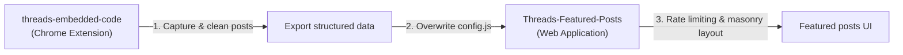
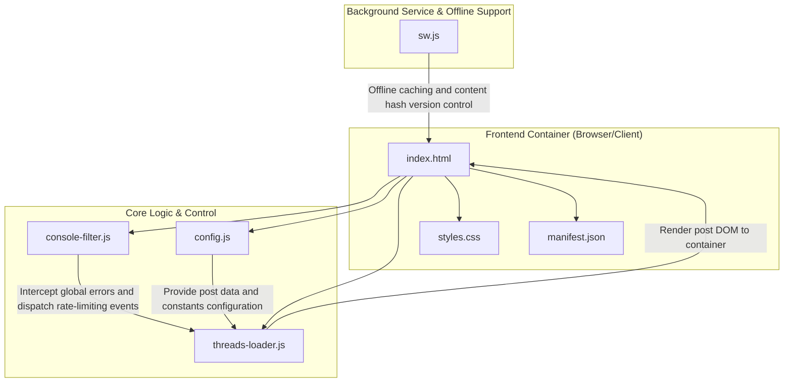

# Threads Featured Posts

English | [繁體中文](./README.md)

An elegant, responsive, and highly stable web application built using pure front-end technologies for displaying and paginating Threads posts. Features an automated rate-limiting exponential backoff mechanism, iframe load error interception with graceful degradation, and Progressive Web App (PWA) offline caching for a seamless browsing experience.

---

## Ecosystem & Integration

This project works in tandem with [Threads Code Saver (threads-embedded-code)](https://github.com/Scorpio-meow/threads-embedded-code) to form a complete ecosystem for capturing, managing, and presenting Threads posts:



1. **Data Collection**: Use the [threads-embedded-code](https://github.com/Scorpio-meow/threads-embedded-code) extension to capture posts while browsing Threads, automatically cleaning UI noise and exporting structured data.
2. **Content Presentation**: This application reads [config.js](./config.js) data to deliver a robust, rate-limited, search-filtered presentation page.

---

## Quick Start

This is a pure front-end static project with zero compilation or complex dependencies. It runs on any static file server.

### 1. Clone Project

```bash
git clone https://github.com/Scorpio-meow/Threads-Featured-Posts.git
cd Threads-Featured-Posts
```

### 2. Configure Post Data

Place Threads Embed Codes into the `posts` array in [config.js](./config.js). Using the companion browser extension is recommended:

1. **Install Companion Extension**:
   ```bash
   git clone https://github.com/Scorpio-meow/threads-embedded-code.git
   ```
   Open `chrome://extensions/` in your browser, enable Developer mode, and click "Load unpacked" to select the extension folder.
2. **Export Posts**:
   In the extension management dashboard, click "Export", copy the structured array data, and overwrite the `posts` array in [config.js](./config.js).

### 3. Start Local Development Server

Use Bun to launch a local static web server to preview the application:

**Start with Bun (Recommended):**
```bash
bunx http-server -p 3000
```

**Start with Python (Fallback):**
```bash
python -m http.server 3000
```

Open your browser and navigate to `http://localhost:3000`.

---

## Features

- **Search & Tag Filtering**: Real-time fuzzy matching search by author handle, post text, or hashtag. A top tag bar displays popular hashtags sorted by frequency with expanded toggle support and URL query state synchronization.
- **Manual & System Theme Switching**: Seamlessly toggle between Dark and Light themes with preference saved in `localStorage`. Full CSS variable design system dynamically updates `blockquote` `data-theme` attributes.
- **Flexible Layout Options**: Switch between multi-column Masonry Grid and single-column List layout. Masonry utilizes native CSS `columns` for responsive auto-adjustment.
- **Automated Rate-Limiting Backoff**: Global interception of HTTP 429 errors and Threads script failures. Displays a real-time countdown banner during rate limiting and automatically resumes loading after exponential backoff.
- **Performance Optimization & Chunked Rendering**: Utilizes `requestIdleCallback` for non-blocking DOM rendering with shimmer skeleton placeholders to protect Interaction to Next Paint (INP).
- **Deterministic Seeded Shuffle**: Supports one-click random sorting with seed generation stored in the `random` URL parameter, ensuring page pagination consistency.
- **PWA & Offline Support**: Service Worker caches essential static assets. Includes [manifest.json](./manifest.json) for standalone app installation on desktop and mobile.
- **Robust Iframe Monitoring**: `MutationObserver` and `ResizeObserver` monitor iframe health, performing graceful fallback (replacing failed embeds with fallback direct links) when height drops below 200px or timeouts occur.
- **Single Post Preview Mode**: Direct URL routing via `?post=` parameter to isolate single post cards while hiding global controls and pagination.
- **Loading Progress Panel**: Glassmorphism progress bar showing real-time load percentages, next embed countdowns, and estimated remaining loading duration.
- **Console Noise Interceptor**: [console-filter.js](./console-filter.js) suppresses cross-origin 404 warnings and postMessage noise thrown by official Threads embed scripts.
- **FAQ & Diagnostic Panel**: Integrated footer modal with accordion FAQ and one-click `?debug=1` toggle.

---

## Configuration & Data Formats

### Configuration Settings

Adjust runtime constants in [config.js](./config.js):

| Setting | Description | Default |
| :--- | :--- | :---: |
| `LOAD_DELAY` | Base load delay (ms) after backoff or standard operations (minimum safety bound 4000ms) | `4000` |
| `BATCH_SIZE` | Maximum concurrent iframe load limit (capped at 1 for rate-limit compliance) | `1` |
| `EMBED_STAGGER_DELAY` | Stagger interval (ms) between adjacent embed requests (minimum safety bound 3600ms) | `3600` |
| `IFRAME_TIMEOUT` | Single iframe load timeout duration (ms) | `3600` |
| `MIN_IFRAME_TIMEOUT` | Threshold (ms) before initial iframe presence check | `8000` |
| `RATE_LIMIT_BACKOFF` | Base backoff (ms) on HTTP 429 (escalates by 1.5x up to 300s) | `60000` |
| `MAX_DELAY` | Dynamic delay ceiling (ms) | `60000` |
| `MIN_DELAY_BETWEEN_REQUESTS` | Minimum safety interval between embed requests (ms) | `3600` |
| `MAX_VISIBLE_QUEUE` | Maximum post DOM elements retained in active memory | `30` |
| `PAGE_SIZE_OPTIONS` | Allowed items per page options array | `[1, 3, 5, 10, 25, 50]` |
| `PAGE_SIZE` | Default items per page count | `10` |

### Data Formats

The `posts` array in [config.js](./config.js) supports two formats:

#### Format 1: Raw HTML String

```javascript
const posts = [
    '<blockquote class="text-post-media" data-text-post-permalink="https://...">...</blockquote>',
];
```

#### Format 2: Structured Object (Recommended)

```javascript
const posts = [
    {
        embedCode: '<blockquote class="text-post-media" ...>...</blockquote>',
        postLink: 'https://www.threads.net/@username/post/xxx',
        author: 'username',
        content: 'Post text content...',
        tags: ['tag1', 'tag2']
    },
];
```

### URL Query Parameters

| Parameter | Description | Example |
| :--- | :--- | :--- |
| `page` | Active page index | `?page=2` |
| `page_size` | Items per page limit | `?page_size=25` |
| `random` | Random shuffle seed timestamp | `?random=1717750000000` |
| `search` | Fuzzy search string (author, content, tags) | `?search=tech` |
| `tag` | Exact hashtag filter (without `#`) | `?tag=code` |
| `post` | Single preview target (`postLink` or index) | `?post=https://www.threads.net/@username/post/xxx` |
| `debug` | Set to `1` to unblock raw console logs | `?debug=1` |

---

## Architecture & Technical Details

### Tech Stack

| Category | Description |
| :--- | :--- |
| **Frontend Core** | Pure HTML5, CSS3, Vanilla JavaScript (ES5/ES6 compatible) |
| **Dependencies** | Zero external framework dependencies |
| **Styling & Fonts** | Google Fonts (Manrope, Noto Sans TC), CSS variables, glassmorphism, native CSS columns |
| **Offline & PWA** | Service Worker API, Cache Storage, Web App Manifest |
| **Deployment** | Any static web host (GitHub Pages, Vercel, Netlify) |

### Architecture Flowchart



---

## License

[MIT License](./LICENSE)