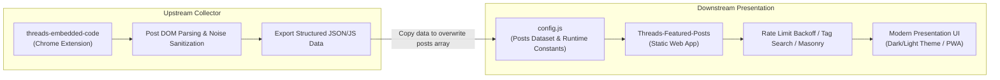
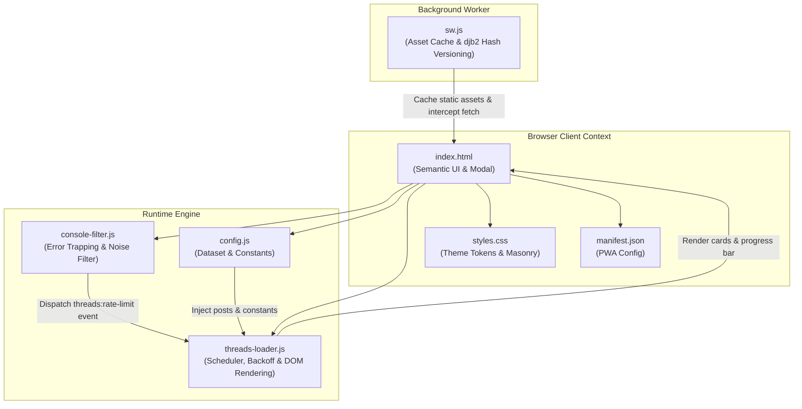
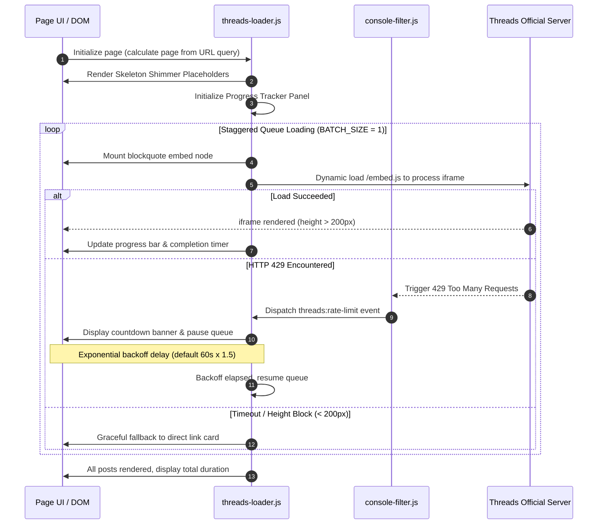

# Threads Featured Posts

English | [繁體中文](./README.md)

An elegant, responsive, and highly stable web application built using pure front-end technologies for displaying and paginating Threads posts. Features an automated rate-limiting exponential backoff mechanism, iframe load error interception with graceful degradation, deterministic seeded shuffling, and Progressive Web App (PWA) offline caching for a seamless browsing, searching, and presentation experience.

---

## Ecosystem & Integration

This project works in tandem with [Threads Code Saver (threads-embedded-code)](https://github.com/Scorpio-meow/threads-embedded-code) to form a complete ecosystem for capturing, managing, and presenting Threads posts:



1. **Data Collection (Upstream)**: Use the [threads-embedded-code](https://github.com/Scorpio-meow/threads-embedded-code) extension to capture posts while browsing Threads, automatically cleaning UI noise and exporting structured data.
2. **Content Presentation (Downstream)**: This application reads [config.js](./config.js) data to deliver a robust, rate-limited, search-filtered, and responsive presentation page.

---

## Quick Start

This is a pure front-end static project with zero compilation or complex dependencies. It runs on any static file server.

### 1. Clone Project

```bash
git clone https://github.com/Scorpio-meow/Threads-Featured-Posts.git
cd Threads-Featured-Posts
```

### 2. Configure Post Data

Place Threads Embed Codes into the `posts` array in [config.js](./config.js). Using the companion browser extension is recommended:

1. **Install Companion Extension**:
   ```bash
   git clone https://github.com/Scorpio-meow/threads-embedded-code.git
   ```
   Open `chrome://extensions/` in your browser, enable Developer mode, and click "Load unpacked" to select the extension folder.
2. **Export Posts**:
   In the extension management dashboard, click "Export", copy the structured array data, and overwrite the `posts` array in [config.js](./config.js).

### 3. Start Local Development Server

Use Bun to launch a local static web server to preview the application:

**Start with Bun (Recommended):**
```bash
bunx http-server -p 3000
```

**Start with Python (Fallback):**
```bash
python -m http.server 3000
```

Open your browser and navigate to `http://localhost:3000`.

---

## Core Features

- **Search & Tag Filtering**: Real-time fuzzy matching search by author handle, post text, or hashtag. A top tag bar displays popular hashtags sorted by frequency with expand/collapse toggle support and two-way URL query parameter synchronization.
- **Dark/Light Theme Switching**: Seamlessly toggle between Dark and Light themes with preference saved in `localStorage`. Full CSS custom property design system dynamically updates `blockquote` `data-theme` attributes upon switching.
- **Flexible Layout Options**: Switch between multi-column Masonry Grid and single-column List layout. Masonry utilizes native CSS `columns` for responsive auto-adjustment.
- **Automated Rate-Limiting Backoff**: Global interception of HTTP 429 errors and Threads script failures. Displays a real-time countdown banner during rate limiting and automatically resumes loading after exponential backoff (escalating 1.5x up to 300s).
- **Non-Blocking Chunked Rendering**: Utilizes `requestIdleCallback` for non-blocking DOM rendering with shimmer skeleton placeholders to protect Interaction to Next Paint (INP) and eliminate UI jank.
- **Deterministic Seeded Shuffle**: Supports one-click random sorting with seed timestamp generation stored in the `random` URL parameter, ensuring page pagination consistency across page reloads.
- **PWA & Offline Support**: Service Worker caches essential static assets using djb2 content hashing for automated version cache updates. Includes [manifest.json](./manifest.json) for standalone app installation on desktop and mobile.
- **Robust Iframe Monitoring**: `MutationObserver` and `ResizeObserver` monitor iframe health, performing graceful fallback (replacing failed embeds with fallback direct links) when height drops below 200px or timeouts occur.
- **Single Post Preview Mode**: Direct URL routing via `?post=` parameter to isolate single post cards while automatically hiding global controls, search bar, and pagination.
- **Loading Progress Panel**: Glassmorphism progress bar showing real-time load percentages, next embed countdowns, and estimated remaining loading duration.
- **Console Noise Interceptor**: [console-filter.js](./console-filter.js) suppresses cross-origin 404 warnings and postMessage noise thrown by official Threads embed scripts.
- **FAQ & Diagnostic Panel**: Integrated footer modal with accordion FAQ and one-click `?debug=1` toggle.

---

## Configuration & Data Formats

### Runtime Configuration Settings

Adjust runtime constants in [config.js](./config.js):

| Setting | Type | Default | Description |
| :--- | :---: | :---: | :--- |
| `LOAD_DELAY` | number | `4000` | Base load delay (ms) between embed loads (safety bound: 4000ms) |
| `BATCH_SIZE` | number | `1` | Concurrent iframe loads limit (capped at 1 to prevent 429 limits) |
| `EMBED_STAGGER_DELAY` | number | `3600` | Stagger interval (ms) between adjacent embed requests (safety bound: 3600ms) |
| `IFRAME_TIMEOUT` | number | `3600` | Single iframe load timeout duration threshold (ms) |
| `MIN_IFRAME_TIMEOUT` | number | `8000` | Threshold (ms) before initial iframe presence check |
| `RATE_LIMIT_BACKOFF` | number | `60000` | Base backoff (ms) on HTTP 429 (escalates by 1.5x up to 300s) |
| `MAX_DELAY` | number | `60000` | Dynamic delay ceiling (ms) |
| `MIN_DELAY_BETWEEN_REQUESTS` | number | `3600` | Minimum safety interval between embed requests (ms) |
| `MAX_VISIBLE_QUEUE` | number | `30` | Maximum post DOM elements retained in active memory |
| `PAGE_SIZE_OPTIONS` | number[] | `[1, 3, 5, 10, 25, 50]` | Allowed items per page options array |
| `PAGE_SIZE` | number | `10` | Default number of items per page |

### Post Data Schema

[config.js](./config.js) supports two formats in the `posts` array:

#### Structured Object Format (Recommended)

```javascript
const posts = [
    {
        embedCode: '<blockquote class="text-post-media" data-text-post-permalink="https://www.threads.com/@username/post/xxx">...</blockquote>',
        postLink: 'https://www.threads.com/@username/post/xxx',
        author: 'username',
        content: 'Post text content...',
        tags: ['tag1', 'tag2']
    }
];
```

#### Raw HTML String Format (Legacy Compatibility)

```javascript
const posts = [
    '<blockquote class="text-post-media" data-text-post-permalink="https://www.threads.com/@username/post/xxx">...</blockquote>'
];
```

### TypeScript Interface

```typescript
interface PostItem {
    embedCode: string;   // Threads blockquote embed HTML code
    postLink: string;    // Full URL to the original Threads post
    author: string;      // Author username without @
    content: string;     // Extracted plain text content
    tags: string[];      // Array of hashtag keywords
}
```

### URL Query Parameters

| Parameter | Type | Example | Description |
| :--- | :---: | :--- | :--- |
| `page` | integer | `?page=2` | Target page number |
| `page_size` | integer | `?page_size=25` | Number of items per page |
| `random` | string | `?random=1717750000000` | Seed timestamp for deterministic random shuffle |
| `search` | string | `?search=frontend` | Search keyword matching author, content, or tags |
| `tag` | string | `?tag=tech` | Exact tag filtering (excluding `#`) |
| `post` | string | `?post=https://www.threads.com/@username/post/xxx` | Single post preview mode (URL or index) |
| `debug` | string | `?debug=1` | Enable full logging and bypass console filtering |

---

## Architecture & Technical Details

### Tech Stack

| Category | Technology | Description |
| :--- | :--- | :--- |
| **Frontend Core** | HTML5 / CSS3 / Vanilla JavaScript | Zero third-party heavy frameworks |
| **Typography** | Google Fonts (Manrope, Noto Sans TC) | Clean geometric aesthetic with CJK readability |
| **Styling** | Native CSS Variables / Glassmorphism / CSS `columns` | Theme switching and fluid responsive masonry |
| **Offline Cache** | Service Worker API / Cache Storage API | Automated cache invalidation via djb2 content hashing |
| **App Delivery** | Web App Manifest (PWA) | Standalone desktop and mobile install support |
| **Hosting** | Any static Web Server | GitHub Pages, Cloudflare Pages, Vercel, Netlify |

### Module Architecture



### Post Load & Rate Limit Lifecycle



---

## FAQ & Troubleshooting

### Q1: Why do some post cards only display a "View on Threads" button?
This is due to Threads' cross-origin and anti-scraping protections. To display official embed cards:
1. Ensure you are logged into [Threads](https://www.threads.com/) in your browser.
2. Disable "Do Not Track" in browser privacy settings (it blocks Meta embed authentication cookies).
3. Whitelist `cdninstagram.com` and `threads.com` in ad blockers (e.g. uBlock Origin).

### Q2: What is "Rate Limiting" and how does the application handle it?
When requesting multiple embed iframes rapidly, Meta's server responds with HTTP 429. The application automatically:
- Pops up a countdown banner and pauses subsequent queue processing.
- Automatically resumes loading after the exponential backoff duration expires.
- To reduce rate limit occurrences, decrease `PAGE_SIZE` (e.g. 3 or 5) or increase `LOAD_DELAY` and `EMBED_STAGGER_DELAY` in [config.js](./config.js).

### Q3: How to enable debug mode?
Append `?debug=1` to the URL (e.g., `http://localhost:3000/?debug=1`) to view unfiltered cross-origin warnings and scheduling diagnostics in the browser console (F12).

---

## License

This project is open source and available under the [MIT License](./LICENSE).